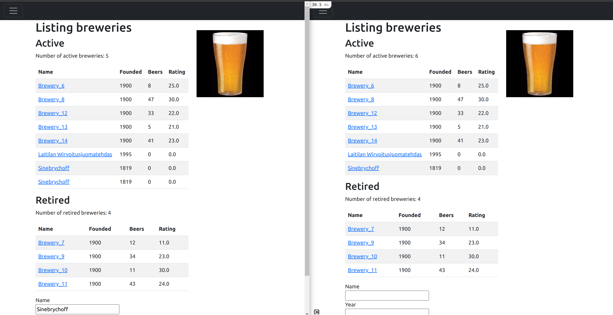
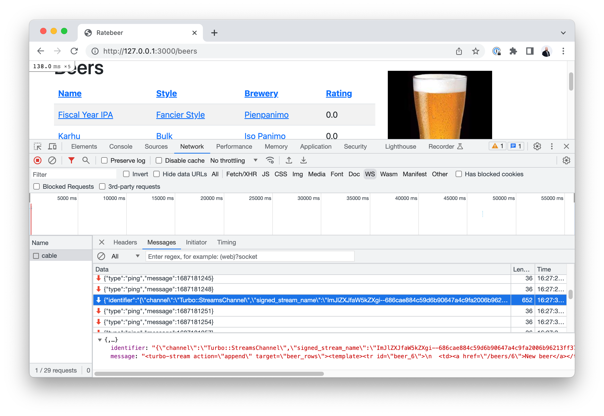

## Hotwire

Rails 7 introduces Hotwire to help creating dynamic views in Rails easier, with minimal Javascript.

**What problem do Hotwire techniques intend to solve?**

The real benefit of Rails in the past has been that it allows creating **full applications** quickly. However, "Full application" definition has changed in 15 years. Users are accustomed to having dynamic, mobile friendly experiences: faster, partial, dynamic page loads and interactivity.

To deliver, developers have needed other software tools such as ReactJS library to create the services. This adds to the complexity of the apps and also diminshes the View part of RAils MVC into a REST/GraphQL API.

So with the introduction of Hotwire, Rails sets out to handle the complexities of rapidly changing Javascript world and provide a more uniform way of handling needs of Full-stack applications.

**What does Hotwire include:**

- Turbo - speed up pages by dividing page into components and make dynamic updates
- Stimulus - allow Javascript functionality with minimal Javascript
- Strada (not yet available as a framework and not part of this course) - building iOS and Anrdoid applications using Rails and Turbo
  - Strada functionality is currently being developed as [turbo-ios](https://github.com/hotwired/turbo-ios) and [turbo-android](https://github.com/hotwired/turbo-android)

## Pagination

After last week's [increased amount of beers](https://github.com/mluukkai/WebPalvelinohjelmointi2023/blob/main/english/week7.md#server-caching-functionality) you start to wonder that it would be kinda nice to have a pagination for our beers page. Let's add it.

First we start by adding links for previous and next pages to the end of our beers table in `/beers/index.html.erb`:

```erb
<table class="table table-striped table-hover">
  <thead>
  # ...
  </thead>
  <tbody>
    <% beers.each do |beer| %>
      # ...
    <% end %>
    <tr>
      <td colspan="2" class="text-center">
        <%= link_to "<<< Previous page", beers_path %>
      </td>
      <td colspan="2" class="text-center">
        <%= link_to "Next page >>>", beers_path %>
      </td>
    </tr>
  </tbody>
</table>
```

Our links don't do much yet so let's add some logic to the controller as well. Last week we defined ordering of the beers in our controller like so:

```ruby
def index
  @beers = Beer.includes(:brewery, :style, :ratings).all

  order = params[:order] || 'name'

  @beers = case order
            when 'name' then @beers.sort_by(&:name)
            when 'brewery' then @beers.sort_by{ |b| b.brewery.name }
            when 'style' then @beers.sort_by{ |b| b.style.name }
            when "rating" then @beers.sort_by(&:average_rating).reverse
            end
end
```

Which contains a bit of a problem. Method `sort_by` will load all the beers to central memory as an array and only then sort the order. But now we would want to fetch only limited amount of records from the database at a time, only what is needed for the current page. There's no sense fetching all the beers. That's why we'll opt out for using ActiveRecord SQL queries instead for ordering:

```ruby
def index
  @beers = Beer.includes(:brewery, :style, :ratings).all

  order = params[:order] || 'name'

  @beers = case @order
           when "name" then @beers.order(:name)
           when "brewery" then @beers.joins(:brewery).order("breweries.name")
           when "style" then @beers.joins(:style).order("styles.name")
           when "rating" then @beers.left_joins(:ratings)
                                    .select("beers.*, avg(ratings.score)")
                                    .group("beers.id")
                                    .order("avg(ratings.score) DESC")
           end  
end
```

This will allow us to use ActiveRecord methods `limit` and `offset` to fetch only the wanted amount of records from the database at a time. We can set the wanted amount per page to top our `beers_controller.rb` via constant:

```ruby
class BeersController < ApplicationController
  PAGE_SIZE = 20
  # ...
end
```

After that we can define our `index` method like so:

```ruby
def index
    @order = params[:order] || 'name'
    @page = params[:page]&.to_i || 1
    @last_page = (Beer.count / PAGE_SIZE).ceil
    return if request.format.html? && fragment_exist?("beerlist-#{@order}")

    @beers = Beer.includes(:brewery, :style, :ratings).all

    @beers = case @order
             when "name" then @beers.order(:name)
             when "brewery" then @beers.joins(:brewery).order("breweries.name")
             when "style" then @beers.joins(:style).order("styles.name")
             when "rating" then @beers.left_joins(:ratings)
                                      .select("beers.*, avg(ratings.score)")
                                      .group("beers.id")
                                      .order("avg(ratings.score) DESC")
             end
    @beers = @beers.limit(PAGE_SIZE).offset((@page - 1) * PAGE_SIZE)
end
```

Pay attention to the `@last_page` instance variable as we are going to need it in our view. Now we are going to add the new `@page` instance variable to all of our links in the index and redefine our previous and next page links.

```erb
<table class="table table-striped table-hover">
  <thead>
      <th><%= link_to "Name", beers_path(page: @page, order: "name")%></th>
      <th><%= link_to "Style", beers_path(page: @page, order: "style")%></th>
      <th><%= link_to "Brewery", beers_path(page: @page, order: "brewery")%></th>
      <th><%= link_to "Rating", beers_path(page: @page, order: "rating")%></th>
  </thead>
  <tbody>
    <% @beers.each do |beer| %>
      <tr>
        <td><%= link_to beer.name %></td>
        <td><%= link_to beer.style.name, beer.style %></td>
        <td><%= link_to beer.brewery.name, beer.brewery %></td>
        <td><%= round(beer.average_rating) %></td>
      </tr>
    <% end %>
    <tr>
      <td colspan="2" class="text-center">
        <% unless @page == 1 %>
          <%= link_to "<<< Previous page", beers_path(page: @page - 1, order: @order) %>
        <% end %>
      </td>
      <td colspan="2" class="text-center">
        <% unless @page == @last_page %>
          <%= link_to "Next page >>>", beers_path(page: @page + 1, order: @order) %>
        <% end %>
      </td>
    </tr>
  </tbody>
</table>
```

Remember to also update our cache key to include our new `@page` variable:

```erb
<% cache "beerlist-#{@page}-#{@order}", skip_digest: true do %>
```


And voilà! We have working pagination for our beers. But one thing that is kinda annoying is that when we navigate between the pages, the whole pages gets reloaded with menus and all even though the contents of the table are the only thing changing. Here is where we come to where Turbo Frames can help us...

## Turbo Frames

**Turbo Frames** are predefined parts of our page that we can update on request. In case of our beers page, we can update just the table containing beers for the current page and keep everything else as is.

Let's start by creating a new partial `_beers_page.html.erb` and extracting our table to it so our `index.html.erb` looks something like this:

```erb
<h1>Beers</h1>

<% cache "beerlist-#{@page}-#{@order}", skip_digest: true do %>
  <div id="beers">
    <%= render "beers_page", beers: @beers, page: @page, order: @order, last_page: @last_page  %>
  </div>
<% end %>

<%= link_to('New Beer', new_beer_path) if current_user %>
```

After that is working, we can wrap our table in _beer_page.html.erb with a turbo frame:

```erb
<%= turbo_frame_tag "beers_page" do %>
  <table class="table table-striped table-hover">
    # ...
  </table>
<% end %>
```

Turbo frame will now take every link and button inside it into its control and render the new pages produced by the links inside the turbo frame. But to make this properly work we need to edit our index method in `beers_controller.rb` a bit.

```ruby
  def index
    # ...
    if turbo_frame_request?
      render partial: "beers_page",
        locals: { beers: @beers, page: @page, order: @order, last_page: @last_page }
    else
      render :index
    end
  end
```

`turbo_frame_request?` conditional will make sure that when the request comes inside a turbo frame, only the partial containing our beer table is returned. We can now even check what happens inside the network tab of our browser's developer tools.


We see that our headers contain id of the turbo frame we are targeting so Turbo knows which part of the page to replace.


And we see that indeed our response contains only the partial and nothing else. Turbo has automatically even prevented our application layout coming with the html document.

The only thing is that now the links to beers, breweries and styles are not working. Turbo is loading the links and trying to replace our table with their contents but does not find suitable turbo tag for as the replacement. This is easily fixed by marking target attribute for our links:

```erb
<% beers.each do |beer| %>
  <tr>
    <td><%= link_to beer.name, beer, data: { turbo_frame: "_top"} %></td>
    <td><%= link_to beer.style.name, beer.style, data: { turbo_frame: "_top"} %></td>
    <td><%= link_to beer.brewery.name, beer.brewery, data: { turbo_frame: "_top"} %></td>
    <td><%= round(beer.average_rating) %></td>
  </tr>
<% end %>
```

Target `_top` means that Turbo will break out of the frame and replace the whole page with the opened up page. The target could be something else as well, like `_self` targeting current frame itself or id of another turbo frame on which case Turbo would attempt to target that frame instead.

We also notice that now when changing pages, the url won't change and using return button of the browser might take us to unexpected places. This is also easily fixed by promoting our turbo actions into _visits_.

```erb
<%= turbo_frame_tag "beers_page", data: { turbo_action: "advance" } do %>
```

What happens under the hood of Turbo is that it will actually use Javascript to manipulate the HTML DOM of the page without us needing to write any line of JavaScript!

<blockquote>

## Exercise 1

`turbo_frame_tag` has an attribute `src` available that will lazy load the contents of the source address into the turbo frame.

1. Refactor breweries page so that there is new partial `_breweries_list.html.erb` which is used separately to list breweries under active breweries and retired breweries.
2. Create new endpoints behind `breweries/active` and `breweries/retired` routes that return the partials for the active and retired breweries respectively.
3. Use `turbo_frame_tag` with `src` attribute to lazy load active and retired breweries into their respective turbo frames.
4. Fix the links to breweries so that they work inside the turbo frames.
</blockquote>

## Turbo Streams

**The point of Turbo streams** is to allow page updates in fragments more dynamically than with Turbo Frames. When Turbo Frames are replaced in their entirety, you can use Turbo Streams for example, if you have a page with a list of breweries, you can append or remove just a single brewery from the list in response to a change, instead of having to do a full page reload or reload of the whole table.

In modern web applications this kind of behavior is usually achieved by using a server-side REST API or GraphQL API that provides the needed information in JSON format. Then frontend side queries for the information, receives the JSON and uses that to render the needed HTML and updates the DOM accordingly. 

Turbo intends to do this more simply, by streaming ready-made HTML to the browser and handling the required actions under the hood.

Key concepts here are **Actions**, **Targets** and **Templates**, ie. What action should be done to which target elements using what template data.

## Actions

**Actions** define what should be done to a page element. Turbo Streams supports 7 different actions:

- `append`/`prepend` element to a collection (f.ex. add beer to list)
- Insert element `before`/`after` another element
- `remove` element
- `update`/`replace` element (almost same, but update will do the substitution more subtly)

## Identifying targets in the view

For actions to work, Turbo needs to know which part of the webpage the action is targeting so you need to identify the page elements in views accordingly. Targeting can be done either to single element or to multiple elements.

For a **single element**, you need a unique ID that can be used to identify the element. You can achieve this by explicitly creating the id value in the view, or using Turbo frame tag, but most convenient way is to use the Rails [dom_id](https://api.rubyonrails.org/classes/ActionView/RecordIdentifier.html) helper to autogenerate the tag.

For example:

```erb
<div id="<%= dom_id(brewery) %>">
  <%= brewery.name %>
</div>
```

This would result in a unique id like:

```
<div id="brewery_55">Sinebrychoff</div>
```

You can also target **multiple elements** by using [css selectors](https://developer.mozilla.org/en-US/docs/Web/CSS/CSS_Selectors). For example, if your breweries also have class elements based on style, such as:

```
<div class="active" id="brewery_55">Sinebrychoff</div>
<div class="active" id="brewery_62">Laitilan Wirvoitusjuomatehdas</div>
<div class="retired" id="brewery_71">Pyynikin käsityöläispanimo</div>
```

you could use the remove action to remove all retired breweries from the list by targeting the class ".retired".

## Design templates as partials

To make use of Turbo streams, you must design view templates as partials that can be rendered individually. If you want to stream changes to breweries, such as append new brewery rows to a list of breweries, then brewery row should be a partial.

Let's now make the Breweries index page ready for streaming.

Extract your row rendering logic (created in Exercise 1) in `app/views/breweries/_breweries_list.html.erb` from:

```erb
<tbody>
  <% breweries.each do |brewery| %>
    <tr %>">
      <td><%= link_to brewery.name, brewery, data: { turbo_frame: "_top"} %></td>
      <td><%= brewery.year %></td>
      <td><%= brewery.beers.count %></td>
      <td><%= round(brewery.average_rating) %></td>
    </tr>
  <% end %>
</tbody>

```

To new partial file `app/views/breweries/_brewery_row.html.erb`:

```erb
<tr %>">
  <td><%= link_to brewery.name, brewery, data: { turbo_frame: "_top"} %></td>
  <td><%= brewery.year %></td>
  <td><%= brewery.beers.count %></td>
  <td><%= round(brewery.average_rating) %></td>
</tr>

```

And change the original code to use this partial :

```erb
<tbody id="<%= status %>_brewery_rows">
  <% breweries.each do |brewery| %>
    <%= render "brewery_row", brewery: brewery %>
  <% end %>
</tbody>
```

Pay attention to new ID that we give to the table. We need `active_brewery_rows` or `retired_brewery_rows` ID to **target** the **action** of appending new beers as children of the correct table. If in Exercise you did not define local `status` or something similar containing `active`/`retired` information for the different brewery listings, you should do that now as it will help us later.

Now let's allow adding new breweries directly from index page. Define a Turbo Frame to include a part of our already existing code in the index page `app/views/breweries/index.html.erb`

Substitute:

```
<%= link_to "New brewery", new_brewery_path if current_user %>
```

With:

```
<%= turbo_frame_tag "new_brewery", src: new_brewery_path if current_user %>
```

And in `app/views/breweries/_new.html.erb` define which part of the view you want to show in the frame:

```
<h1>New brewery</h1>

<%= turbo_frame_tag "new_brewery" do %>
  <%= render "form", brewery: @brewery %>
<% end %>
# ...
```


This allows us to add breweries directly from the index. But on closer look, adding a brewery does a full update of the page. That is not want we want. To only append the created brewery to the list and keep the rest of the page as it was, we need to change the response in controller `app/controllers/breweries_controller.rb`:

```ruby
def create
  @brewery = Brewery.new(brewery_params)

  respond_to do |format|
    if @brewery.save
      format.turbo_stream {
        status = @brewery.active? ? "active" : "retired"
        render turbo_stream: turbo_stream.append("#{status}_brewery_rows", partial: "brewery_row", locals: { brewery: @brewery })
      }
      format.html { redirect_to brewery_url(@brewery), notice: "Brewery was successfully created." }
      format.json { render :show, status: :created, location: @brewery }
    else
      format.html { render :new, status: :unprocessable_entity }
      format.json { render json: @brewery.errors, status: :unprocessable_entity }
    end
  end
end
```

This is only adding couple lines of code. But a lot of things are needed for this to work:

(1) When browser creates the new request, Turbo framework adds `text/vnd.turbo-stream.html` to the request's `Accept` headers.


(2) Based on the Accept header, the controller knows to only return a turbo_stream template instead of a full page update

(3) `turbo_stream.append` renders a response HMTL fragment with action "append", targeting "beer_rows" and using partial `_beer_row.html.erb`, resulting in following fragment:

```
<turbo-stream action="append" target="active_brewery_rows"><template><tr id="brewery_65">
  <td><a data-turbo-frame="_top" href="/breweries/65">Laitilan Wirvoitusjuomatehdas</a></td>
  <td>1995</td>
  <td>0</td>
  <td>0.0</td>
</tr></template></turbo-stream>
```

(4) Based on the ID we added to the table body earlier `<tbody id="active_brewery_rows">`, Turbo knows to append the template as the last child of the table body. To test, try removing or changing the ID and see what happens.

## ActionCable provides dynamic updates

So far, we have been using Turbo Streams to update page fragments using the normal HTTP request-response logic. Browser sends a request that accepts turbo_stream as a response. This works fine and keeps the flow dynamic and ligthweight for a single user.

What if we want to stream the fragment to all browsers that are currently viewing the beers index without them needing to hit refresh? This has been quite simple since Rails version 5 which introduced ActionCable, a Rails way of using WebSockets (see [WebSockets in 100 seconds](https://www.youtube.com/watch?v=1BfCnjr_Vjg) for a very quick overview and [Rails ActionCable documentation](https://edgeguides.rubyonrails.org/action_cable_overview.html) for more details).

In order for our browser to start listening to changes, we need to define a stream/channel we want to listen to. In the top of our view `app/views/breweries/index.html.erb` we want to "subscribe" to the updates by declaring:

```
<%= turbo_stream_from "breweries_index" %>
```

This establishes a WebSocket connection between the browser and the server.

And in order to publish updates, we can do this in our Breweries model `app/models/brewery.rb`

```
after_create_commit -> { broadcast_append_to "brewery_index", partial: "breweries/brewery_row", target: "active_brewery_rows" }, if: :active?
after_create_commit -> { broadcast_append_to "brewery_index", partial: "breweries/brewery_row", target: "retired_brewery_rows" }, if: :retired?

def active?
  active
end

def retired?
  !active
end
```

This means that each time a new brewery is created, an `append` action is triggered, broadcast to channel `breweries_index`, targeting element with ID `active_brewery_rows` or `retired_brewery_rows` depending on its status and using the `_brewery_row.html.erb` partial to create the template. This is almost exactly the same thing that we did earlier by responding to a client request with the fragment. The difference is that the HTML fragment is broadcast to all browsers subscribed to this channel. And the fact that it is using Websockets for communication. You can verify it (almost) works by opening two browser windows side by side and creating new a new brewery.



As you notice, we have a problem. The user who is adding new breweries, gets duplicate entries on the list. Pause here for a moment and think why this happens.

The reason is that the current user actually receives the fragments twice. Once as an HTTP response to the form submission, triggered by the create-action in controller. And another time as a WebSocket update, triggered by the after_create_commit in the model.

There are multiple ways to solve this.
1. The stream template in HTTP response could be commented out from the controller. The downside is that if there are problems with WebSockets, then the user does not see the effect of submitting a new beer.
2. Or we might check who the logged-in user is and only conditionally trigger the after_create_commit hook from the model.
3. Or use the simplest way by giving each row a unique identifier. Let's go with that solution here:

In `app/views/beers/_brewery_row.html`:

```erb
<tr id="<%= dom_id(brewery) %>">
  <td>...
  
```

This way each row has a unique identifier which prevents the duplication. This unique identifier is actually required if we would like to, for example, trigger a remove action to a brewery.

You can observe the WebSocket connection details using browser developer tools and WS selection from Network tab:


Note that we used a simple string "beer_index" to create a unique identifier for the channel. That was sufficient since there is only one beer_index. But in some cases we would like to use an object to identify the stream. For example, if we would implement ability to add new beers to a particular brewery from the Brewery page and stream the added data only to that page, we would want to use something like  `@brewery`instead of `"beer_index"`. This way, multiple users could be on different brewery pages and streaming would be able to target those pages. 

<blockquote>

## Exercise 2

Change the breweries list to include a button "X" (or text "remove") that will remove the brewery from the database. Implement the changes in steps:

1. Make it work first without using Turbo, allowing a full page reload after delete.
2. Then dynamically remove the deleted brewery from the list by using Turbo stream from the BreweriesController. 
3. Then use WebSockets to stream the removal to all listening browsers. You need to use `after_destroy_commit` in a similar way we used `after_create_commit` above. For available callbacks, see [Transaction callbacks in Rails](https://guides.rubyonrails.org/active_record_callbacks.html#transaction-callbacks)
4. And finish it off by introducing a confirmation popup. When user clicks the remove button, a confirmation with text "Are you sure you want to remove beer X?" should pop up, with options "Cancel" and "Remove".

</blockquote>

<blockquote>

## Exercise 3

In the front page, there are _"Number of active breweries"_ and _"Number of retired breweries"_. Make these numbers dynamic, so that if any user adds or retires a brewery, the changes are streamed to reflect these numbers in real time.
</blockquote>


## Stimulus
...

<blockquote>

## Exercise ?

When we add new breweries in the brewery page, our form does not get emptied out after adding the brewery. Create function for that using stimulus and trigger it from the create button.
</blockquote>

<blockquote>

## Exercise ??

Add beer creation form to the beers page as well. Figure out a way how to know with Stimulus to which page the item was added and automatically switch the currently viewed page to the page where the item was added.
[Too hard maybe?]
</blockquote>

## ActionCable, Redis and Fly.io

In production environment, ActionCable that provides the base for working with Turbo streams requires redis. So you should have redis installed.

If you don't already have a redis instance, or if there were issues installing redis (it might fail on running fly launch), you should create it from command line:
```
# Check if you already have an instance
fly redis list

# If not, create one:
fly redis create
```

And fetch the redis address from the console. Then configure the server:
```
fly redis status <your-redis-instance-name>
# Will give detailed information, including a line:
# Private URL = redis://default:somethingsomething...something.upstash.io

fly secrets set REDIS_URL=redis://default:somethingsomething...something.upstash.io
```

By default, fly configures your gemfile with redis gem version higher than 5. If you are running Rails version lower than 7.0.4,, you need an older version of the gem. So in your Gemfile, replace the redis config with:

```
gem "redis", ">= 3", "< 5"
```
