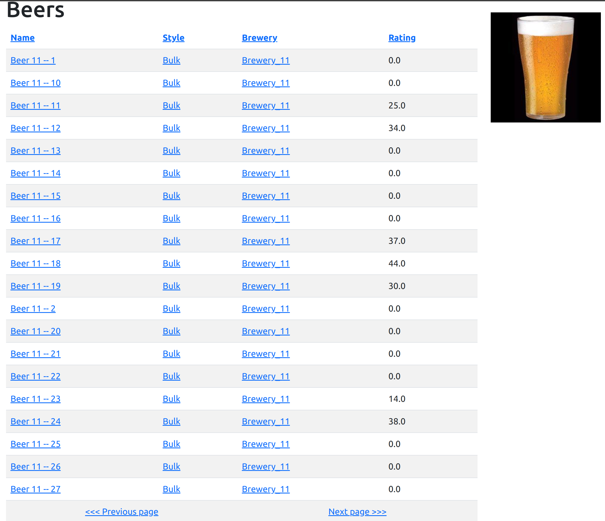
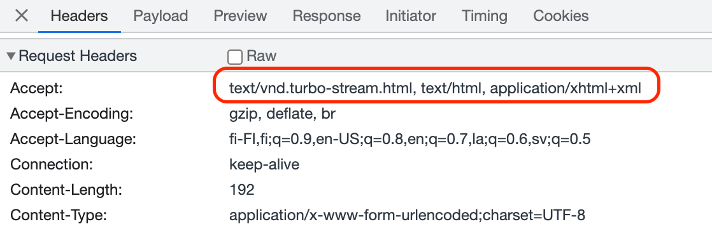
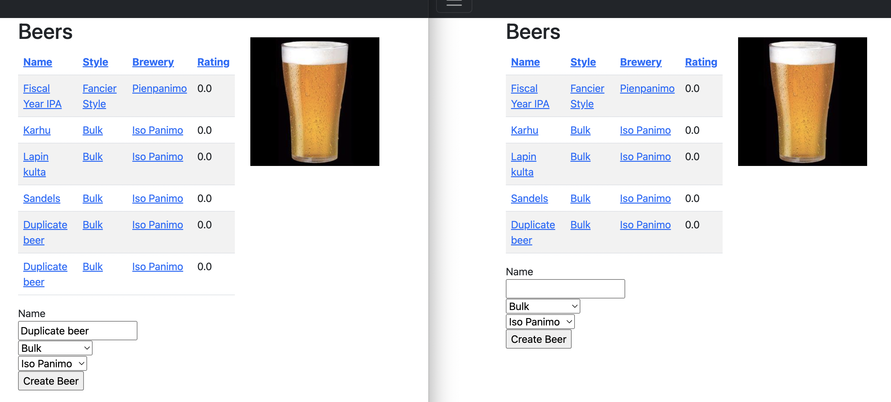

# Hotwire

## Table of Contents

* [Introduction to Hotwire](#introduction-to-hotwire)
  * [Why Hotwire?](#why-hotwire)
* [Introduction to Hotwire Components](#introduction-to-hotwire-components)
* [Hotwire Components in Detail](#hotwire-components-in-detail)
  * [Turbo Frames](#turbo-frames)
  * [Turbo Steams](#turbo-streams)
    * [Turbo Streams Actions](#turbo-steams-actions)
    * [Targeting Elements in Views for Turbo Actions](#targeting-elements-in-views-for-turbo-actions)
    * [Utilizing Partial Templates for Turbo Streams](#utilizing-partial-templates-for-turbo-streams)
    * [Dynamic Updates with ActionCable](#dynamic-updates-with-actioncable)
  * [Stimulus](#stimulus)
* [Turbo Streams Exercises](#turbo-streams-exercises)
  * [Implementing Beer Removal with Confirmation Pop-up](#implementing-beer-removal-with-confirmation-pop-up)
  * [Dynamic Updating of Active and Retired Breweries](#dynamic-updating-of-active-and-retired-breweries)
* [Stimus Exercises](#stimulus-exercises)
* [ActionCable, Redis, and Fly.io Integration](#actioncable-redis-and-flyio-integration)

## Introduction to Hotwire

Ruby on Rails version 7.x introduces a new functionality called [Hotwire](https://hotwired.dev/), aimed at simplifying the creation of dynamic views with minimal reliance on Javascript. Hotwire empowers Rails developers to incorporate partial reloading of user interface elements in a similar fashion to popular Javascript libraries like [React](https://react.dev/), all while leveraging the familiar syntax of the Ruby language.

### Why Hotwire?

Throughout its history, the Rails framework has been renowned for its ability to enable the rapid development of __fully-featured applications__. However, over the past 15 years, the concept of a _"fully-featured application"_ has evolved significantly. Today's users have come to expect dynamic, mobile-friendly experiences that encompass faster, partial, and interactive page loads.

To meet these expectations, developers have had to rely on additional software tools, such as the React library, to build the necessary functionality. Unfortunately, this approach adds complexity to the applications and often diminishes the role of the View component within the Rails [MVC](https://en.wikipedia.org/wiki/Model%E2%80%93view%E2%80%93controller) architecture, reducing it to merely serving as a [REST](https://en.wikipedia.org/wiki/Representational_state_transfer) or [GraphQL](https://en.wikipedia.org/wiki/GraphQL) API.

With the introduction of Hotwire, Rails aims to tackle the challenges posed by the rapidly evolving Javascript landscape. This is in contrast to the more steadily-paced Ruby ecosystem, which tends to favor incremental and conservative evolution. Hotwire offers a more streamlined and cohesive approach to fulfilling the requirements of full-featured, full-stack applications. It achieves this by eliminating the reliance on disparate tools and aligning with the ethos of Rails as a comprehensive platform for web application development. Hotwire provides the tools to construct dynamic and interactive user experiences while maintaining consistency with the familiar Rails paradigms.

## Introduction to Hotwire Components

Hotwire encompasses three core components, each serving a specific purpose: Turbo, Stimulus, and Strada (not covered in this course).

1. __Turbo__

__Turbo Frames__ and __Turbo Streams__ enhance page loading speed by dividing the page into components and facilitating dynamic updates.

* __Turbo Streams over HTTP__ - Delivering updates directly through HTTP responses, reducing page reloads.
* __Turbo Streams over Action Cable__ - Real-time updates using Action Cable's WebSocket framework.
* __WebSockets with Turbo__ - Bidirectional communication for real-time updates and interactivity.

2. __Stimulus__

Stimulus is a lightweight Javascript framework that enhances interactivity and user interactions in server-rendered HTML views. By attaching JavaScript behavior to HTML elements, it improves the user experience without complex frameworks or extensive coding.

3. __Strada__

Strada is an extension of Hotwire that allows developers to build iOS and Android applications using Rails and Turbo. Currently, Strada is being developed as separate repositories: [turbo-ios](https://github.com/hotwired/turbo-ios) for iOS and [turbo-android](https://github.com/hotwired/turbo-android) for Android, respectively.

## Hotwire Components in Detail

### Turbo Frames

TBA

### Turbo Streams

The purpose of [Turbo Streams](https://turbo.hotwired.dev/handbook/streams) is to enable page updates in fragments. For example, when a page displays a list of beers, instead of performing a complete page reload, a single beer can be appended or removed from the list in response to a change.

In modern web applications, achieving this behavior often involves having a separate server-side REST API or GraphQL API, commonly referred to as the back-end, to provide the necessary information in JSON format. The front-end queries this back-end, receives the JSON data, and renders the required HTML while updating the DOM accordingly.

Turbo simplifies this process by streaming pre-rendered HTML, compiled on the back-end, directly to the browser and handling the necessary actions internally.

Key concepts in Turbo Streams include __actions__, __targets__, and __templates__. These concepts determine which action should be applied to specific target elements using specific template data.

#### Turbo Streams Actions

In Turbo Streams, __actions__ are a fundamental concept used to specify the changes or updates that should be performed on the client-side HTML DOM in response to a server-side event. An action represents a specific operation that can be applied to one or more target elements within a Turbo Stream response.

__Actions__ are defined using HTML-like syntax and consist of a combination of elements and attributes. Each action includes a target element, which represents the HTML element on the client-side that needs to be updated, and one or more operations that define how the target element should be modified.

The operations that can be applied to a target element include:

| Action    | Description |
|-----------|-------------------------------------------------------------------|
| `append`  | Appends new content after the target element.                     |
| `prepend` | Prepends new content before the target element.                   |
| `replace` | Replaces the content of the target element with new content.      |
| `update`  | Updates specific attributes or properties of the target element.  |
| `remove`  | Removes the target element from the DOM.                          |

#### Targeting Elements in Views for Turbo Actions

In order for __actions__ to function properly, Turbo requires the identification of target elements within the DOM. This can be achieved by assigning unique HTML `id` parameters to individual elements or by utilizing `class` parameters to target multiple elements.

For identifying a single element, one can explicitly create an ID value in the view or leverage the convenient Rails [dom_id](https://api.rubyonrails.org/classes/ActionView/RecordIdentifier.html) helper, which automatically generates the ID tag. For example:

```erb
<div id="<%= dom_id beer %>">
  <%= beer.name %>
</div>
```

This would result in a unique ID like:

```erb
<div id="beer_55">Karhu</div>
```

Alternatively, when targeting __multiple elements__ based on specific [CSS class selectors](https://developer.mozilla.org/en-US/docs/Web/CSS/CSS_Selectors), such as:

```erb
<div class="lager" id="beer_55">Karhu</div>
<div class="ipa" id="beer_62">S-marketin IPA</div>
<div class="lager" id="beer_71">Aura</div>
```

The remove action can be used to remove all elements with the class `lager` by targeting the CSS selector `.lager`.

#### Utilizing Partial Templates for Turbo Streams

To leverage the capabilities of Turbo Streams, view templates should be designed as [partials](https://guides.rubyonrails.org/layouts_and_rendering.html#using-partials) that can be rendered individually. This enables targeted streaming of changes to specific components. For example, when streaming updates for beers and appending new beer rows to a list, the beer row should be implemented as a partial.

1. __Extracting Row Rendering Logic__

To prepare the Beers index page for streaming, extract the row rendering logic from the `app/views/beers/index.html.erb` file and create a new partial file `app/views/beers/_beer_row.html.erb`:

```erb
<tbody>
  <% @beers.each do |beer| %>
     <tr>
  	  <td><%= link_to beer.name, beer %></td>
	    <td><%= link_to beer.style.name, beer.style %></td>
	    <td><%= link_to beer.brewery.name, beer.brewery %></td>
	    <td><%= round(beer.average_rating) %></td>
    </tr>
  <% end %>
</tbody>
```

Replace the original code in `app/views/beers/index.html.erb` with the new partial:

```erb
<tr>
  <td><%= link_to beer.name, beer %></td>
  <td><%= link_to beer.style.name, beer.style %></td>
  <td><%= link_to beer.brewery.name, beer.brewery %></td>
  <td><%= round(beer.average_rating) %></td>
</tr>
```

Make sure to assign a unique ID to the table body element, such as `id="beer_rows"`. This ID will be used to target the action of appending new beers as children of the table.

```erb
<tbody id="beer_rows">
  <% @beers.each do |beer| %>
    <%= render partial: "beer_row", locals: {beer: beer} %>
  <% end %>
</tbody>
```

2. __Allowing Adding New Beers from Index Page__

Next, let's enable the addition of new beers directly from the index page. Replace the following code in `app/views/beers/index.html.erb`:

```erb
<%= link_to('New Beer', new_beer_path) if current_user %>
```

With the following Turbo Frame tag:

```erb
<% if current_user %>
  <%= turbo_frame_tag "new_beer", src: new_beer_path %>
<% end %>
```

This Turbo Frame will include a part of our existing code from the `new_beer` path.

3. __Defining Partial View for Adding New Beer__

Create a new partial file `app/views/beers/_new.html.erb` and specify which part of the view you want to show in the Turbo Frame:

```erb
<h1>New beer</h1>
<%= turbo_frame_tag "new_beer" do %>
  <%= render "form", beer: @beer %>
<% end %>
```



4. __Modifying the Controller Response__

In order to append the created beer to the list without doing a full page update, we need to modify the response in the create action of the `app/controllers/beers_controller.rb` file.

By adding the `format.turbo_stream` block, we specify that the response should be rendered as a Turbo Stream template with the action of appending the new beer row to the target element with the ID `beer_rows`. These steps enable the addition of beers directly from the index page while only appending the created beer to the list without refreshing the entire page.

```ruby
def create
	@beer = Beer.new(beer_params)

	respond_to do |format|
		if @beer.save
			format.turbo_stream { render turbo_stream: turbo_stream.append("beer_rows", partial: "beer_row", locals: { beer: @beer }) }
			format.html { redirect_to beers_path, notice: "Beer was successfully created." }
			format.json { render :show, status: :created, location: @beer }
		else
			format.html { render :new, status: :unprocessable_entity }
			format.json { render json: @beer.errors, status: :unprocessable_entity }
		end
	end
end
```

This process involves a simple addition of code, but several components are necessary to ensure its proper functioning:

1. When the browser initiates a new request, the Turbo framework includes the `text/vnd.turbo-stream.html` in the request's `Accept` headers. This informs the server that it expects a Turbo Stream template instead of a full page update.



2. The controller, based on the `Accept` header, recognizes the request's Turbo Stream format and responds by rendering a Turbo Stream template instead of a complete page. This ensures that only the necessary HTML fragments are sent back to the browser.

3. Using the `turbo_stream.append` method, a response HTML fragment is generated with the action set to `append`. This fragment targets the element with the identifier `beer_rows` and utilizes the `_beer_row.html.erb` partial to generate the content. Here is an example of the resulting fragment:

```html
<turbo-stream action="append" target="beer_rows">
  <template>
    <tr id="beer_7">
      <td><a href="/beers/7">Fancy beer</a></td>
      <td><a href="/styles/1">Bulk</a></td>
      <td><a href="/breweries/1">Iso Panimo</a></td>
      <td>0.0</td>
    </tr>
  </template>
</turbo-stream>
```

4. With the table body previously assigned an ID, such as `<tbody id="beer_rows">`, Turbo knows to append the generated template as the last child of the table body element. It intelligently places the new content in the appropriate location. You can test this behavior by removing or altering the ID and observing the resulting outcome.

#### Dynamic Updates with ActionCable

[ActionCable](https://edgeguides.rubyonrails.org/action_cable_overview.html) enables dynamic updates by utilizing [WebSockets](https://en.wikipedia.org/wiki/WebSocket), providing real-time streaming of content to multiple browsers. Unlike traditional request-response logic, which requires the browser to send a request and await a response, ActionCable allows seamless updates without the need to refresh the page. This functionality has been available since Rails version 5 and is based on WebSockets technology. For futher information, see [WebSockets in 100 seconds](https://www.youtube.com/watch?v=1BfCnjr_Vjg).

To establish a connection between the browser and the server for listening to changes, we define a stream or channel. In our view file, `app/views/beers/index.html.erb`, we "subscribe" to updates using the following line of code:

```erb
<%= turbo_stream_from "beer_index" %>
```

This code establishes a WebSocket connection between the browser and the server, enabling the browser to receive real-time updates.

To publish updates, we utilize the Beer model `app/models/beer.rb`. Whenever a new beer is created, the following code is triggered:

```ruby
after_create_commit -> { broadcast_append_to "beer_index", partial: "beers/beer_row", target: "beer_rows" }
```

This line of code broadcasts an `append` action to the `beer_index` channel, targeting the element with the ID `beer_rows`. It uses the `_beer_row.html.erb` partial to create the template for the new beer. Essentially, it replicates the same functionality we implemented earlier by responding to client requests with fragments. However, the difference lies in the fact that the HTML fragment is now broadcasted to all browsers subscribed to the `beer_index` channel, thanks to the power of WebSockets.

You can test the functionality by opening two browser windows side by side and creating a new beer. You'll observe that the updates are instantly reflected in both windows, demonstrating the real-time nature of ActionCable and WebSockets.



During the process, you may have noticed a problem: when a user adds new beers, duplicate entries appear in the list. Let's take a moment to understand why this happens.

The reason is that the current user receives the fragments twice. Firstly, as an HTTP response to the form submission triggered by the create action in the controller. Secondly, as a WebSocket update triggered by the `after_create_commit` hook in the model.

To address this issue, there are several possible solutions:

1. Comment out the stream template in the HTTP response from the controller. However, this approach has a downside: if there are any issues with WebSockets, the user won't see the effect of submitting a new beer.

2. Conditionally trigger the `after_create_commit` hook in the model based on the logged-in user. This approach ensures that the user only receives the WebSocket update once.

3. Opt for a simpler solution by giving each row a unique identifier. Let's proceed with this approach here.

In app/views/beers/_beer_row.html, add the following line of code:

```erb
<tr id="<%= dom_id beer %>">
  <td>...
```

By assigning a unique identifier to each row, we prevent duplication. This unique identifier becomes essential if we want to trigger actions, such as removing a specific beer.

To observe the WebSocket connection details, you can use the browser's developer tools.


It's worth noting that in our example, we used a simple string, `beer_index`, as the identifier for the channel since there is only one `beer_index`. However, in certain scenarios, you may want to use an object to identify the stream. For instance, if you implement the ability to add new beers to a specific brewery from the Brewery page and stream the added data only to that page, you would want to use something like `@brewery` instead of `"beer_index"`. This way, multiple users on different brewery pages can be targeted with the streaming updates.

### Stimulus

[Stimulus](https://stimulus.hotwired.dev/) is a JavaScript framework designed to enhance interactivity in HTML, eliminating the need for extensive custom JavaScript development. By utilizing a set of JavaScript modules that can be seamlessly attached to HTML elements using specific attributes, Stimulus enables developers to create simpler and more maintainable code.

One of the notable advantages of Stimulus is its seamless integration with Rails, making it an ideal choice for web applications built on the Rails framework. Leveraging the latest browser technologies, Stimulus delivers a fast and seamless user experience, ensuring optimal performance.

__Benefits__

* Reduces the amount of custom JavaScript required to implement common functionality, streamlining development efforts.
* Provides a straightforward and intuitive API for dispatching and listening to events on webpages, simplifying event handling.
* Enhances performance by avoiding the overhead associated with full-fledged JavaScript frameworks.

__Considerations__

* Stimulus may not be the ideal choice for complex applications that demand extensive client-side functionality.
* Careful organization and structuring of Stimulus controllers is necessary to prevent bloated and unmanageable code.
* Developers who are unfamiliar with the Stimulus framework may experience a learning curve and added complexity during development.

#### Stimulus Controllers

#### Stimulus Actions

#### Stimulus Targets

#### Stimulus Values

## Turbo Streams Exercises

### Implementing Beer Removal with Confirmation Pop-up

Enhance the beers list functionality by adding a button or text "X" for removing a beer from the database. The implementation should follow these steps:

1. __Initial Removal (No Turbo, Full Page Reload)__
Initially, make the removal work without using Turbo, resulting in a full page reload after the delete action.

2. __Dynamic Removal with Turbo Stream__
Improve the functionality by dynamically removing the deleted beer from the list using Turbo Stream. Ensure the removal is reflected in the UI without requiring a full page reload.

3. __WebSocket Integration for Real-Time Updates__
Leverage WebSockets to stream the removal action to all connected browsers in real time.

4. __Confirmation Pop-up__
Enhance the user experience by introducing a confirmation pop-up. When a user clicks the remove button, a confirmation dialog should appear with the text "Are you sure you want to remove beer X?". The pop-up should provide options for "Cancel" and "Remove" actions.

### Dynamic Updating of Active and Retired Breweries

On the front page, you will find two sections: _Number of Active Breweries_ and _Number of Retired Breweries_. Make these numbers dynamic so that any addition or retirement of a brewery by any user triggers real-time updates. The changes should be streamed to reflect the updated counts instantly.


## ActionCable, Redis, and Fly.io Integration

To ensure seamless operation of __ActionCable__, the foundational component for Turbo streams, in a production environment, it is necessary to have [Redis](https://redis.io/) installed. Please follow the steps outlined below to ensure a proper configuration.

1. __Verify Redis Installation__

Check if you already have a Redis instance by running the following command in your terminal:

`$ fly redis list`

If no Redis instance is listed or if you encountered issues during the installation process (e.g., failure during `fly launch`), proceed to create a Redis instance using the command:

`$ fly redis create`

2. __Fetch Redis Address and Configure the Server__

Retrieve the Redis address by executing the following command in your terminal:

`$ fly redis status <your-redis-instance-name>`

This command will provide detailed information, including a line displaying the private URL in the format: `Private URL = redis://default:somethingsomething...something.upstash.io`. Configure the server by setting the Redis URL as a secret. Execute the command:

`$ fly secrets set REDIS_URL=redis://default:somethingsomething...something.upstash.io`

3. __Gemfile Configuration__

By default, Fly.io configures your `Gemfile` with a Redis gem version higher than 5. However, if you are running a Rails version lower than 7.0.4, you will need an older version of the gem. Update your `Gemfile` with the following Redis configuration:

```ruby
gem "redis", ">= 3", "< 5"
```

## Stimulus Exercises

TBA