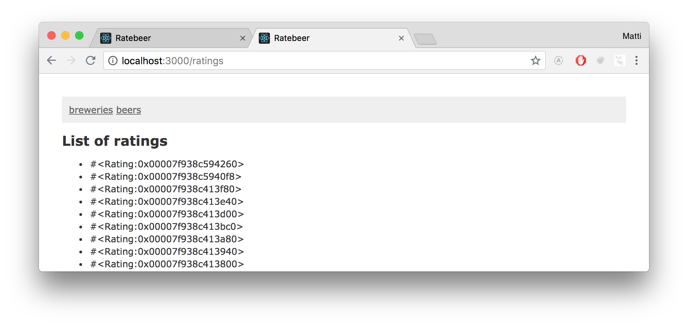
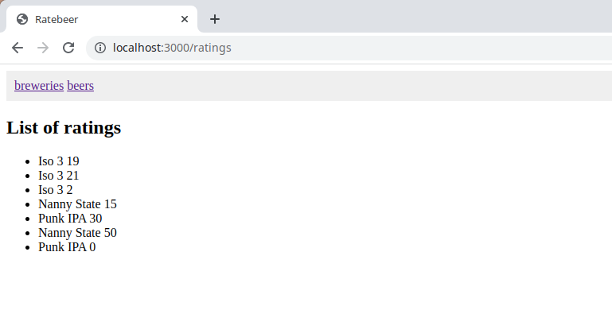
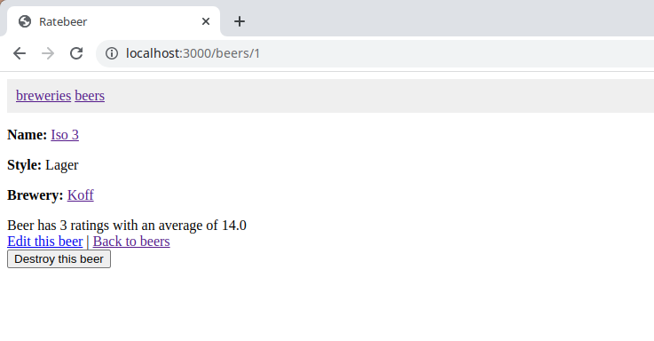
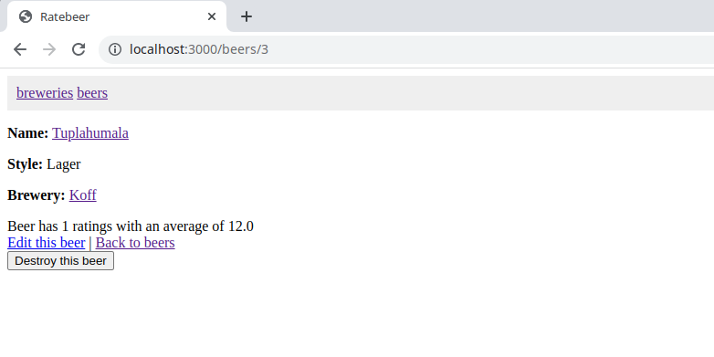
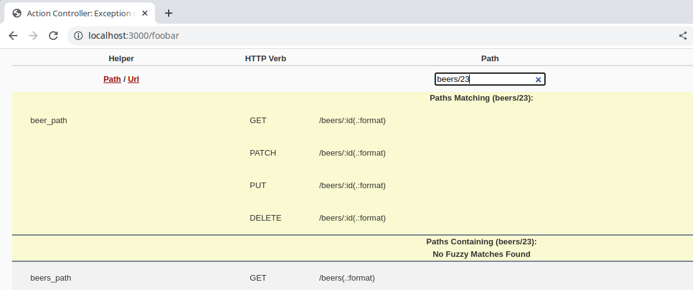
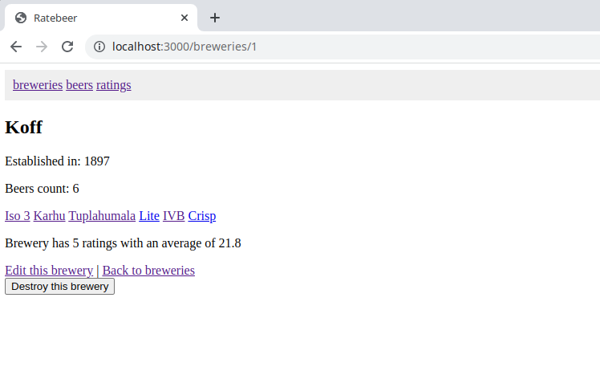

Jatkamme sovelluksen rakentamista siitä, mihin jäimme viikon 1 lopussa. Allaoleva materiaali olettaa, että olet tehnyt kaikki edellisen viikon tehtävät. Jos et tehnyt kaikkia tehtäviä, voit täydentää ratkaisusi tehtävien palautusjärjestelmän kautta näkyvän esimerkivastauksen avulla.

## Järkevä editori

Käytäthän jo järkevää editoria, eli jotain muuta kun nanoa, geditiä tai notepadia? Suositeltavia editoreja ovat esim. RubyMine, Visual Studio Code, ks. lisää [täältä](https://github.com/mluukkai/WebPalvelinohjelmointi2023/blob/main/wadror.md#editoriide).

Nykyään hyvin yleisesti käytössä on [Visual Studio Codea](https://code.visualstudio.com). Jos käytät VSC:tä, kannattaa ehdottamasti asentaa [Ruby-plugin](https://code.visualstudio.com/docs/languages/overview)

Tärkeintä editorin valinnassa on kuitenkin loppuviimeeksi se, että käyttäjälle sen käyttäminen on mieluisaa.

## Sovelluksen layout

Haluamme laittaa sivulle modernien web-sivustojen tyyliin navigointipalkin eli sijoittaa sovelluksen _kaikkien_ sivujen ylälaitaan linkit oluiden ja panimoiden listoihin.

Navigointipalkki saadaan generoitua helposti metodin <code>link_to</code> ja polkuapumetodien avulla lisäämällä jokaiselle sivulle seuraavat linkit:

```erb
<%= link_to 'breweries', breweries_path %>
<%= link_to 'beers', beers_path %>
```

Tarkkasilmäisimmät saattoivat jo viime viikolla huomata, että näkymätemplatet eivät sisällä kaikkea sivulle tulevaa HTML-koodia. Esim. yksittäisen oluen näkymätemplate /app/views/beers/show.html.erb on seuraava:

```erb
<p style="color: green"><%= notice %></p>

<%= render @beer %>

<div>
  <%= link_to "Edit this beer", edit_beer_path(@beer) %> |
  <%= link_to "Back to beers", beers_path %>

  <%= button_to "Destroy this beer", @beer, method: :delete %>
</div>
```

Jos katsomme yksittäisen oluen sivun HTML-koodia selaimen _view source code_ -toiminnolla, huomaamme, että sivulla on paljon muutakin kuin templatessa määritelty HTML (osa headin sisällöstä on poistettu):

```html
<!DOCTYPE html>
<html>
<head>
  <title>Ratebeer</title>
  <link data-turbolinks-track="true" href="/assets/application.css?body=1" media="all" rel="stylesheet" />
  <script data-turbolinks-track="true" src="/assets/jquery.js?body=1"></script>
  <meta content="authenticity_token" name="csrf-param" />
  <meta content="hZaC8o95xUbekA3PTsVZ+JmkVj9CCn5a4Kw8tF96WOU=" name="csrf-token" />
</head>
<body>

<p id="notice"></p>

<p>
  <strong>Name:</strong>
  Iso 3
</p>

<p>
  <strong>Style:</strong>
  Lager
</p>

<p>
  <strong>Brewery:</strong>
  1
</p>

<a href="/beers/1/edit">Edit</a> |
<a href="/beers">Back</a>


</body>
</html>
```

Sivu sisältää siis dokumentin tyypin määrittelyn, käytettävät tyylitiedostot ja javascript-tiedostot määrittelevän head-elementin ja sivun sisällön määrittelevän body-elementin (ks. lisää http://www.w3.org/community/webed/wiki/HTML/Training).

Oluen sivun näkymätemplate siis sisältää ainoastaan body-elementin sisälle tulevan HTML-koodin.

On tyypillistä, että sovelluksen kaikki sivut ovat body-elementin sisältöä lukuun ottamatta samat. Railsissa saadaankin määriteltyä kaikille sivuille yhteiset osat sovelluksen _layoutiin_, eli tiedostoon app/views/layouts/application.html.erb. Oletusarvoisesti tiedoston sisältö on seuraavanlainen:

```erb
<!DOCTYPE html>
<html>
  <head>
    <title>Ratebeer</title>
    <meta name="viewport" content="width=device-width,initial-scale=1">
    <%= csrf_meta_tags %>
    <%= csp_meta_tag %>

    <%= stylesheet_link_tag "application", "data-turbo-track": "reload" %>
    <%= javascript_importmap_tags %>
  </head>

  <body>
    <%= yield %>
  </body>
</html>
```

Head-elementin sisällä olevat apumetodit määrittelevät sovelluksen käyttämät tyyli- ja JavaScript-tiedostot, apumetodi <code>csrf_meta_tags</code> lisää sivulle CSRF-hyökkäykset eliminoivan logiikan (ks. tarkemmin esim. [täältä](http://stackoverflow.com/questions/9996665/rails-how-does-csrf-meta-tag-work)). Kuten arvata saattaa, body-elementin sisällä olevan komennon <code>yield</code>-kohdalle renderöityy kunkin sivun oman näkymätemplaten määrittelemä sisältö.

Saamme navigointipalkin näkyville kaikille sivuille muuttamalla sovelluksen layoutin body-elementtiä seuraavasti:

```erb
<body>
  <div class="navibar">
    <%= link_to 'breweries', breweries_path %>
    <%= link_to 'beers', beers_path %>
  </div>

  <%= yield %>

</body>
```

Navigointipalkki on laitettu luokan _navibar_ sisältävän div-elementin sisällä, joten sen ulkoasua voidaan halutessa muotoilla css:n avulla.

Lisää tiedostoon app/assets/stylesheets/application.css seuraava:

```css
.navibar {
  padding: 10px;
  background: #EFEFEF;
}
```

Kun reloadaat sivun, huomaat, että sovelluksesi antama vaikutelma on jo melko professionaali.

## routes.rb

Railsin Routing-komponentin
(ks. http://api.rubyonrails.org/classes/ActionDispatch/Routing.html, http://guides.rubyonrails.org/routing.html) vastuulla on ohjata eli reitittää sovellukselle tulevien HTTP-pyyntöjen käsittely sopivan kontrollerin metodille.

Tieto siitä miten eri URLeihin tulevat pyynnöt tulee reitittää, konfiguroidaan tiedostoon <code>config/routes.rb</code>. Tässä vaiheessa tiedoston sisältö on seuraavanlainen:

```ruby
Rails.application.routes.draw do
  resources :beers
  resources :breweries
end
```

Tutustumme myöhemmin <code>resources</code>-metodin lisäämiin reitteihin.

Aloitetaan sillä, että tehdään panimoiden listasta sovelluksen oletusarvoinen kotisivu. Tämä tapahtuu lisäämällä routes-tiedostoon rivi:

```ruby
root 'breweries#index'
```

Nyt osoite http://localhost:3000/ ohjautuu kaikki panimot näyttävälle sivulle.

Edellinen on oikeastaan hieman tyylikkäämpi tapa sanoa:

```ruby
get '/', to: 'breweries#index'
```

eli reititä polulle '/' tuleva HTTP GET -pyyntö käsiteltäväksi luokan <code>BreweriesController</code> metodille <code>index</code>.

Englanninkielistä kirjallisuutta lukiessa kannattaa huomata, että Railsin terminologiassa kontrollereiden metodeja nimitetään usein _actioneiksi_. Käytämme kuitenkin kurssilla nimitystä kontrollerimetodi tai kontrollerin metodi.

Voisimme vastaavasti lisätä routes.rb-tiedostoon rivin:

```ruby
get 'kaikki_bisset', to: 'beers#index'
```

jolloin URLiin http://localhost:3000/kaikki_bisset tulevat GET-pyynnöt vievät kaikkien oluiden sivulle. Kokeile että tämä toimii.

Mielenkiintoinen yksityiskohta routes.rb-tiedostossa on se, että vaikka tiedosto näyttää tekstimuotoiselta konfiguraatiotiedostolta, on koko tiedoston sisältö Rubya. Tiedoston rivit ovat metodikutsuja. Esim. rivi:

```ruby
get 'kaikki_bisset', to: 'beers#index'
```

kutsuu get-metodia parametreinaan merkkijono '/kaikki_bisset' ja hash <code>to: 'beers#index'</code>. Hashin yhteydessä on käytetty uudempaa syntaksia, eli vanhaa syntaksia käyttäen reitityksen kohteen määrittelevä hash kirjoitettaisiin <code>:to => 'beers#index'</code>, ja routes.rb-tiedoston rivi olisi:

```ruby
get 'kaikki_bisset', :to => 'beers#index'
```

voisimme käyttää metodikutsussa myös sulkuja, ja määritellä hashin käyttäen aaltosulkuja, eli kömpelöimmässä muodossa reitti voitaisiin määritellä seuraavasti:

```ruby
get( 'kaikki_bisset', { :to => 'beers#index' } )
```

Rubyn joustava syntaksi (yhdessä kielen muutamien muiden piirteiden kanssa) mahdollistaakin luonnollisen kielen sujuvuutta tavoittelevan ilmaisutavan sovelluksen konfigurointiin ja ohjelmointiin. Tyyli tunnetaan englanninkielisellä termillä _Internal DSL_ ks. http://martinfowler.com/bliki/InternalDslStyle.html.

## Oluiden pisteytys

Lisätään seuraavaksi ohjelmaan mahdollisuus antaa oluille "reittauksia" eli pisteytyksiä skaalalla 0-50. Emme käytä viime viikolta tuttua generaattoria (<code>rails generate scaffold...</code>) vaan teemme kaiken itse.

Haluamme että kaikki reittaukset ovat osoitteessa http://localhost:3000/ratings. Kokeillaan nyt selaimella mitä tapahtuu kun urliin yritetään mennä.

Seurauksena on virheilmoitus <code>No route matches [GET] "/ratings"</code> eli osoitteeseen tehtyä HTTP GET -pyyntöä ei vastannut mikään määritelty "reitti".

Lisätään reitti kirjoittamalla routes-tiedostoon seuraava:

```ruby
get 'ratings', to: 'ratings#index'
```

Määrittelemme siis Rails-konventiota mukaillen, että kaikkien reittausten sivun 'ratings' hoitaa RatingsController-luokan metodi index.

Huom: suunnilleen samaa tarkoittaisi myös <code>match 'ratings' => 'ratings#index'</code>. Kuten niin tyypillistä Railsille, voi routes.rb-tiedostossakin käyttää saman asian määrittelemiseen monia erilaisia tapoja.

Kokeile nyt sivua uudelleen selaimella.

Virheilmoitus muuttuu muotoon <code>uninitialized constant RatingsController</code> eli määritelty reitti yrittää ohjata ratings-osoitteeseen tulevan GET-kutsun <code>RatingsController</code>-luokassa määritellyn kontrollerin metodin <code>index</code>-käsiteltäväksi.

Määritellään kontrolleri tiedostoon /app/controllers/ratings_controller.rb.

```ruby
class RatingsController < ApplicationController
  def index
  end
end
```

Huomioi nimeämiskäytännöt ja tiedoston sijainti, Rails etsii kontrolleria nimenomaan hakemistosta /app/controllers. Jos sijoitat kontrollerin muualle, ei Rails löydä sitä.

Kokeile nyt sivua selaimella vielä kerran.

Seurauksena on uusi virheilmoitus:

```
RatingsController#index is missing a template for request formats: text/html
```

Joka taas johtuu siitä, että Rails yrittää renderöidä kontrollerin metodia vastaavan oletusarvoisen, hakemistossa /app/views/ratings/index.html.erb olevan näkymätemplaten, mutta sellaista ei löydy.

Luodaan tiedosto /app/views/ratings/index.html.erb jolla on seuraava sisältö (joudut myös luomaan hakemiston _/app/views/ratings_):

```erb
<h2>List of ratings</h2>

<p>To be completed...</p>
```

Ja nyt sivu toimii!

Huomaa taas Railsin konventiot, tiedoston sijainti on tarkasti määritelty, eli koska kyseessä on näkymätemplate jota kutsutaan ratings-kontrollerista (joka siis on täydelliseltä nimeltään RatingsController), sijoitetaan se hakemistoon /views/ratings.

Muistutuksena vielä [viime viikosta](https://github.com/mluukkai/WebPalvelinohjelmointi2023/blob/main/web/viikko1.md#kontrollerin-ja-viewien-yhteys): kontrollerimetodi <code>index</code> renderöi oletusarvoisesti suorituksensa lopuksi (oikeassa hakemistossa olevan) index-nimisen näkymän. Eli koodi

```ruby
class RatingsController < ApplicationController
  def index
  end
end
```

tekee oikeastaan siis saman asian kuin seuraava:

```ruby
class RatingsController < ApplicationController
  def index
    render :index    # renderöin näkymätemplate /app/views/ratings/index.html
  end
end
```

Eksplisiittinen render-metodin kutsu jätetään kuitenkin yleensä pois jos renderöidään oletusarvoinen, eli kontrollerimetodin kanssa samanniminen template.

## Modelin teko käsin, melkein...

Yhteen olueeseen liittyy useita reittauksia, eli oliomalli pitää päivittää seuraavanlaiseksi:


Tarvitsemme siis tietokantataulun ja vastaavan model-olion.

Railsissa muutokset tietokantaan, esim. uuden taulun lisääminen, kannattaa tehdä **aina** migraatioiden avulla. Migraatiot ovat siis hakemistoon db/migrate sijoitettavia tiedostoja, joihin kirjoitetaan Rubyllä tietokantaa muokkaavat operaatiot. Tutustumme migraatioihin tarkemmin vasta myöhemmin ja käytämme modelin luomiseen nyt Railsin valmista _model-generaattoria_, joka luo model-olion lisäksi automaattisesti tarvittavan migraation.

Reittauksella on kokonaislukuarvoinen <code>score</code> sekä vierasavain, joka linkittää sen reitattuun olueeseen. Railsin konvention mukaan vierasavaimen nimen tulee olla <code>beer_id</code>.

Model ja tietokannan generoiva migraatio saadaan luotua antamalla komentoriviltä komento:

    rails g model Rating score:integer beer_id:integer

ja luodaan tietokantataulu suorittamalla komentoriviltä migraatio

    rails db:migrate

Toisin kuin viime viikolla käyttämämme _scaffold_-generaattori, model-generaattori ei luo ollenkaan kontrolleria eikä näkymätemplateja.

**Muistutuksena viime viikolta:** Railsin generaattorien (scaffold, model, ...) luomat tiedostot on mahdollista poistaa komennolla _destroy_:

    rails destroy model Rating

Jos olet suorittanut jo migraation ja huomaat että generaattorin luoma koodi onkin tuhottava, on **erittäin tärkeää** ensin perua migraatio komennolla

    rails db:rollback

Jotta yhteydet saadaan myös oliotasolle (muistutuksena [viime viikon materiaali](https://github.com/mluukkai/WebPalvelinohjelmointi2023/blob/main/web/viikko1.md#oluet-ja-yhden-suhde-moneen--yhteys)), tulee luokkia päivittää seuraavasti

```ruby
class Beer < ApplicationRecord
  belongs_to :brewery
  has_many :ratings
end

class Rating < ApplicationRecord
  belongs_to :beer
end
```

Eli jokaiseen olueeseen liittyy useita reittauksia ja reittaus kuuluu aina täsmälleen yhteen olueeseen.

Käynnistetään Rails-konsoli antamalla komentoriviltä komento <code>rails c</code>. Huomaa, että jos konsolisi oli jo auki, saat lisätyn koodin konsolin käyttöön komennolla <code>reload!</code>. Luodaan muutama reittaus:

```ruby
> b = Beer.first
> b.ratings.create score: 10
> b.ratings.create score: 21
> b.ratings.create score: 17
```

Reittaukset siis lisätään ensimmäisenä kannasta löytyvälle oluelle. Huomaa luontitapa, saman asian olisi ajanut monimutkaisempi tapa

```ruby
b.ratings << Rating.create(score:15)
```

## Puuttuva viiteavain

Yritetään luoda olut ilman panimoa:

```ruby
irb(main)> b = Beer.create name:"anonymous", style: "watery"
=> #<Beer:0x00007f4444abc8b0 id: nil, name: "anonymous", style: "watery", brewery_id: nil, created_at: nil, updated_at: nil>
irb(main)>
```

_id_ ja aikaleimakentät eivät saa arvoja ollenkaan, näyttääkin siltä että olut ei talletu ollenkaan tietokantaan.

Jos kutsumme oluen metodia _errors_, kertoo olut syyn tallettumisen epäonnistumiselle

```ruby
irb(main)> b.errors
=> #<ActiveModel::Errors [#<ActiveModel::Error attribute=brewery, type=blank, options={:message=>:required}>]>
```

eli olut ei suostu tallettumaan kantaan ilman tietoa panimosta. Voimme korjata tilanteen antamalla arvon panimolle ja kutsumalla oluelle metodia _save_:

```ruby
> b.brewery = Brewery.find_by(name: 'Koff')
> b.save
   (0.1ms)  begin transaction
  Beer Create (1.9ms)  INSERT INTO "beers" ("name", "style", "brewery_id", "created_at", "updated_at") VALUES (?, ?, ?, ?, ?)  [["name", "anonymous"], ["style", "watery"], ["brewery_id", 1], ["created_at", "2022-09-11 18:21:40.830949"], ["updated_at", "2022-09-11 18:21:40.830949"]]
   (0.8ms)  commit transaction
```

Syynä talletuksen epäonnistumiselle on se, että Rails vaatii oletusarvoisesti, että tilanteissa, joissa olio viittaa vierasavaimen avulla toiseen olioon ja koodissa käytetään _belongs_to_ määrettä liitoksen tekemiseen, kuten oluiden tapauksessa tehdään

```ruby
class Beer < ApplicationRecord
  belongs_to :brewery

  # ...
end
```

vierasavaimen arvo [ei saa olla alustamaton](https://blog.bigbinary.com/2016/02/15/rails-5-makes-belong-to-association-required-by-default.html) kun olio talletetaan.

> ## Tehtävä 1
>
> Konsolin käyttörutiini on Rails-kehittäjälle äärimmäisen tärkeää. Tee seuraavat asiat konsolista käsin:
>
> luo uusi panimo "BrewDog", perustamisvuosi 2007<br/>
> lisää panimolle kaksi olutta
>
> - Punk IPA (tyyli IPA)
> - Nanny State (tyyli lowalcohol)
>
> lisää molemmille oluille muutama reittaus
>
> Kertaa tarvittaessa edellisen viikon [materiaalista](https://github.com/mluukkai/WebPalvelinohjelmointi2023/blob/main/web/viikko1.md) konsolia käsittelevät osuudet.
>
> Palauta tämä tehtävä lisäämällä sovelluksellesi hakemisto exercises ja sinne tiedosto exercise1, joka sisältää copypasten konsolisessiosta

Nyt tietokannassamme on reittauksia, ja haluamme saada ne listattua kaikkien reittausten sivulle.

> ## Tehtävä 2
>
> Listataan kaikki reittaukset ratings-sivulla. Ota mallia esim. panimokontrollerin <code>index</code>-metodista ja sitä vastaavasta templatesta. Tee reittauksen lista ensin esim. seuraavaan tyyliin
>
> ```erb
> <ul>
>  <% @ratings.each do |rating| %>
>    <li> <%= rating %> </li>
>  <% end %>
> </ul>
> ```
>
> Lisää sivulle myös tieto reittausten yhteenlasketusta lukumäärästä

Tässä vaiheessa sivun pitäisi näyttää suunnilleen seuraavalta:



Reittaus renderöityy hiukan ikävässä muodossa. Tämä johtuu siitä, että li-elementin sisällä on pelkkä olion nimi, ja koska emme ole määritelleet Ratingille olion merkkijonomuotoa määrittelevää <code>to_s</code>-metodia, käytössä on kaikkien luokkien yliluokalta Objectilta peritty oletusarvoinen <code>to_s</code>.

Luomme hetken kuluttua reittauksille partials-tiedoston, joka pilkkoo koodia osiin ja jonka avulla voimme tuottaa helposti luettavan muodon arvosteluille. Tutkitaan ensin kuitenkin muutamaa asiaa liittyen olion metodien määrittelyyn.

## Muutamia selvennyksiä Railsin model-olioista

Tutkitaan hetki luokkaa <code>Brewery</code>:

```ruby
class Brewery < ApplicationRecord
  has_many :beers
end
```

Panimoilla on nimi <code>name</code> ja perustamisvuosi <code>year</code>. Konsolista käsin pääsemme näihin käsiksi tuttuun tyyliin:

```ruby
> b = Brewery.first
> b.name
=> "Koff"
> b.year
=> 1897
>
```

Teknisesti ottaen esim. <code>b.year</code> on metodikutsu. Rails luo model-olioon jokaiselle vastaavan tietokantataulun skeeman määrittelemälle sarakkeelle kentän eli attribuutin ja metodit attribuutin arvon lukemista ja arvon muuttamista varten. Nämä automaattisesti generoidut metodit ovat sisällöltään suunnilleen seuraavat:

```ruby
class Brewery < ApplicationRecord
  # ..

  def year
    read_attribute(:year)
  end

  def year=(value)
    write_attribute(:year, value)
  end
end
```

Metodit siis mahdollistavat olion attribuutin arvon lukemisen ja muuttamisen. Arvoa muuttava metodi ei kuitenkaan vielä tee muutosta tietokantaan, muutos tapahtuu vasta kutsuttaessa metodia <code>save</code>, kyseessä ovatkin siis automaattisesti generoituvat 'getterit ja setterit'.

Olion ulkopuolelta olion attribuutteihin päästään käsiksi 'pistenotaatiolla':

    b.year

entä olion sisältä? Tehdään panimolle metodi, joka demonstroi panimon attribuuttien käsittelyä panimon sisältä:

```ruby
class Brewery < ApplicationRecord
  has_many :beers

  def print_report
    puts name
    puts "established at year #{year}"
    puts "number of beers #{beers.count}"
  end
end
```

eli olion sisältä metodeja (myös <code>beers</code> on metodi!) voidaan kutsua kuten esim. Javassa, metodin nimellä.

Ja esimerkki metodin käytöstä:

```ruby
> b = Brewery.first
> b.print_report
Koff
established at year 1897
number of beers 2
```

Metodeja olisi voitu kutsua olion sisältä myös käyttäen Rubyn 'thissiä' eli olion <code>self</code>-viitettä:

```ruby
def print_report
  puts self.name
  puts "established at year #{self.year}"
  puts "number of beers #{self.beers.count}"
end
```

Tehdään sitten panimolle metodi, jonka avulla panimon voi 'uudelleenkäynnistää', tällöin panimon perustamisvuosi muuttuu vuodeksi 2022:

```ruby
def restart
  year = 2022
  puts "changed year to #{year}"
end
```

kokeillaan

```ruby
> b = Brewery.first
> b.year
=> 1897
> b.restart
changed year to 2022
> b.year
=> 1897
>
```

eli huomaamme, että vuoden muuttaminen ei toimikaan odotetulla tavalla! Syynä tähän on se, että <code>year = 2022</code> metodin <code>restart</code> sisällä ei kutsukaan metodia

    def year=(value)

joka sijoittaisi attribuutille uuden arvon, vaan luo metodille paikallisen muuttujan nimeltään <code>year</code> johon arvo 2022 sijoitetaan.

Jotta sijoitus onnistuu, on metodia kutsuttava <code>self</code>-viitteen kautta:

```ruby
def restart
  self.year = 2022
  puts "changed year to #{year}"
end
```

ja nyt toiminnallisuus on odotetun kaltainen:

```ruby
> b = Brewery.first
> b.year
=> 1897
> b.restart
changed year to 2022
> b.year
=> 2022
>
```

**HUOM:** Rubyssä olioiden instanssimuuttujat määritellään <code>@</code>-alkuisina. Instanssimuuttujat _eivät_ kuitenkaan ole sama asia kuin ActiveRecordin avulla tietokantaan talletettavat olioiden attribuutit. Eli seuraavakaan metodi ei toimisi odotetulla tavalla:

```ruby
def restart
  @year = 2022
  puts "changed year to #{@year}"
end
```

Panimon sisällä <code>year</code> siis on ActiveRecordin tietokantaan tallentama attribuutti, kun taas <code>@year</code> on olion instanssimuuttuja. Railsin modeleissa instanssimuuttujia ei juurikaan käytetä. Instanssimuuttujia käytetään Railsissa lähinnä tiedonvälitykseen kontrollereilta näkymille.

> ## Tehtävä 3
>
> Muuta sivun ratings-näkymä sellaiseksi, että arvosteluoliosta tehdään parempi merkkijonoesitys muodossa "karhu 35", eli ensin reitatun oluen nimi ja sen jälkeen reittauksen pistemäärä.
>
> Merkkijonon muodostamisessa myös seuraavasta voi olla apua https://github.com/mluukkai/WebPalvelinohjelmointi2023/blob/main/web/rubyn_perusteita.md#merkkijonot
>
> Voit tehdä kaiken suoraan tiedostoon views/partials/index.html.erb tai voit halutessasi myös tehdä luokalle Rating partials-tiedoston, joka hoitaa yhden ratingin muotoilemisen
> 
> Apua partials-tiedoston tekemiseen ja renderöimiseen voi katsoa esim. \_beer.html.erb ja vastaavasta index.html.erb tiedostosta. Muista partials-tiedostojen nimeämiskäytäntö!

Tehtävän jälkeen reittausten sivujen tulisi näyttää suunnilleen seuraavalta:



Huom: kun kirjoitat sovelluksellesi uutta koodia, useimmiten on järkevämpää tehdä kokeiluja konsolista käsin. Seuraavassa kokeillaan reittauksen oletusarvoista <code>to_s</code>-metodin palauttamaa arvoa:

```ruby
> r = Rating.last
> r.to_s
=> "#<Rating:0x007f8054b1cb10>"
>
```

Määritellään reittaukselle <code>to_s</code>-metodi:

```ruby
class Rating < ApplicationRecord
  belongs_to :beer

  def to_s
    "tekstiesitys"
  end
end
```

ja kokeillaan uudelleen konsolista:

```ruby
> r.to_s
=> "#<Rating:0x007f8054b1cb10>"
```

Muutos ei kuitenkaan vaikuta tulleen voimaan, missä vika?

Jotta muutettu koodi tulisi voimaan, on uusi koodi ladattava konsolin käyttöön komennolla <code>reload!</code> ja käytettävä uudestaan kannasta haettua olioa:

```ruby
> reload!
Reloading...
=> true
> r.to_s
=> "#<Rating:0x007f8054b1cb10>"
> r = Rating.last
> r.to_s
=> "tekstiesitys"
>
```

Eli kuten yllä näemme, ei pelkkä koodin uudelleenlataaminen vielä riitä, sillä muuttujassa <code>r</code> olevassa oliossa on käytössä edelleen vanha koodi.

> ## Tehtävä 4
>
> Lisää luokalle <code>Beer</code> metodi <code>average_rating</code>, joka laskee oluen ratingien keskiarvon. Lisää keskiarvo yksittäisen oluen sivulle **jos** oluella on ratingeja.
>
> Näkymätemplatessa voi tehdä tuotettavasta sisällöstä ehdollisen seuraavasti:
>
> ```erb
> <% if beer.ratings.empty? %>
>  beer has not yet been rated!
> <% else %>
>  beer has some ratings
> <% end %>
> ```
>
> Muista palauttaa keskiarvo liukulukuna, tässä voi käyttää apuna `to_f`-metodia.

Tehtävän jälkeen oluen sivun tulisi näyttää suunnilleen seuraavalta (huom: edellisen viikon jäljiltä sivullasi saattaa näkyä panimon nimen sijaan panimon id. Jos näin on, muuta näkymäsi vastaamaan kuvaa):



> ## Tehtävä 5
>
> Moduuli enumerable (ks. https://ruby-doc.org/core-3.1.2/Enumerable.html) sisältää runsaasti oliokokoelmien läpikäyntiin tarkoitettuja apumetodeja.
>
> Oliokokoelmamaiset luokat voivat sisällyttää moduulin enumerable toiminnallisuuden itselleen, ja tällöin ne perivät moduulin tarjoaman toiminnallisuuden.
>
> Tutustu nyt <code>map</code>- ja <code>reduce</code>-metodeihin (ks. esim. [reduce](https://ruby-doc.org/core-3.1.2/Enumerable.html#reduce) [map](https://ruby-doc.org/core-3.1.2/Enumerable.html#map) ja etsi googlella lisää ohjeita) ja muuta (tarvittaessa) oluen reittausten keskiarvon laskeva metodi käyttämään reducea tai mapia ja sumia.
>
> Keskiarvon laskeminen onnistuu tässä tapauksessa myös helpommin hyödyntämällä ActiveRecordin metodeja, ks. http://api.rubyonrails.org/classes/ActiveRecord/Calculations.html

Lisätään konsolista jollekin vielä reittaamattomalle oluelle yksi reittaus. Oluen sivu näyttää nyt seuraavalta:



Sivulla on pieni, mutta ikävä kielioppivirhe:

    beer has 1 ratings

> ## Tehtävä 6
>
> Tutustu Railsissa valmiina olevaan <code>pluralize</code>-apumetodiin http://apidock.com/rails/ActionView/Helpers/TextHelper/pluralize ja tee oluen sivusta metodin avulla kieliopillisesti oikeaoppinen (eli yhden reittauksen tapauksessa tulee tulostua 'beer has 1 rating')

## Lomake ja post

Tehdään nyt sovellukseen mahdollisuus reittausten luomiseen www-sivulta käsin.

Railsin konventioiden mukaan Rating-olion luontiin tarkoitetun lomakkeen tulee löytyä osoitteesta ratings/new, ja lomakkeeseen pääsyn hoitaa ratings-kontrollerin metodi <code>new</code>.

Luodaan vastaava reitti routes.rb-tiedostoon:

```ruby
get 'ratings/new', to:'ratings#new'
```

Lisäämme siis ratings-kontrolleriin (joka siis täydelliseltä nimeltään on RatingsController) metodin <code>new</code>, joka huolehtii lomakkeen renderöinnistä. Metodi on yksinkertainen:

```ruby
def new
  @rating = Rating.new
end
```

Metodi ainoastaan luo uuden Rating-olion ja välittää sen <code>@rating</code>-muuttujan avulla oletusarvoisesti renderöitävälle näkymätemplatelle new.html.erb. Olio luodaan <code>new</code>-komennolla eli sitä ei talleteta tietokantaan.

Luodaan nyt seuraava näkymä eli tiedosto /app/views/ratings/new.html.erb:

```erb
<h2>Create new rating</h2>

<%= form_for(@rating) do |f| %>
  beer id: <%= f.number_field :beer_id %>
  score: <%= f.number_field :score %>
  <%= f.submit %>
<% end %>
```

Mene nyt lomakkeen sisältävälle sivulle eli osoitteeseen http://localhost:3000/ratings/new.

Näkymän avulla muodostuva HTML-koodi näyttää (suunnilleen) seuraavalta (näet koodin menemällä sivulle ja valitsemalla selaimesta _view page source_):

```erb
<form action="/ratings" method="post">
  beer id: <input name="rating[beer_id]" type="number" />
  score: <input name="rating[score]" type="number" />
  <input name="commit" type="submit" value="Create Rating" />
</form>
```

eli generoituu normaali HTML-lomake (ks. tarkemmin http://www.w3.org/community/webed/wiki/HTML/Training#Forms).

Lomakkeen lähetystapahtuman kohdeosoite on /ratings ja käytettävä HTTP-metodi GET:in sijasta POST. Lomakkeessa on kaksi numeromuotoista kenttää ja niiden arvot lähetetään vastaanottajalle POST-kutsun mukana "muuttujien" <code>rating[beer_id]</code> ja <code>rating[score]</code> arvoina.

Railsin metodi <code>form_for</code> siis muodostaa automaattisesti oikeaan osoitteeseen lähetettävän, oikeanlaisen lomakkeen, jossa on syöttökentät kaikille parametrina olevan tyyppisen olion attribuuteille.

Lisää lomakkeiden muodostamisesta <code>form_for</code>-metodilla osoitteessa
http://guides.rubyonrails.org/form_helpers.html#dealing-with-model-objects

Jos yritämme luoda reittauksen, ei mitään näytä tapahtuvan. Selaimen developer-konsoli paljastaa kuitenkin, että selain on tehnyt POST-pyynnön osoitteeseen http://localhost:3000/ratings mutta palvelin on vastannut siihen 404


Joudumme siis luomaan tiedostoon config/routes.rb reitin lomakkeen lähetyksen käsittelyyn:

```ruby
post 'ratings', to: 'ratings#create'
```

Uuden olion luonnista vastaava metodi on Railsin konvention mukaan nimeltään <code>create</code>, luodaan sen pohja:

```ruby
def create
  raise
end
```

Tässä vaiheessa metodi ei tee muuta kuin aiheuttaa poikkeuksen (metodikutsu <code>raise</code>).

Kokeillaan nyt lähettää lomakkeella tietoa. Kontrollerin metodissa heittämä poikkeus aiheuttaa virheilmoituksen. Rails lisää virhesivulle erilaista diagnostiikkaa, mm. HTTP-pyynnön parametrit sisältävän hashin, joka näyttää seuraavalta:

```ruby
{"authenticity_token"=>"[FILTERED]",
 "rating"=>{"beer_id"=>"1", "score"=>"2"},
 "commit"=>"Create Rating"}
```

Hashin sisällä on siis välittynyt lomakkeen avulla lähetetty tieto.

Parametrit sisältävä hash on kontrollerin sisällä talletettu muuttujaan <code>params</code>.

Uuden ratingin tiedot ovat hashissa avaimen <code>:rating</code> arvona, eli pääsemme niihin käsiksi komennolla <code>params[:rating]</code> joka taas on hash jonka arvo on <code>{"beer_id"=>"1", "score"=>"2"}</code>. Eli esim. pistemäärään päästäisiin käsiksi komennolla <code>params[:rating][:score]</code>.

## Debuggeri

Tutkitaan hieman asiaa kontrollerista käsin Railsin debuggeria hyödyntäen

Rails on jo konfiguroinut sovelluksesi käyttöön [debuggerin](https://github.com/ruby/debug). Railsin oletusarvoinen debuggeri ei kuitenkaan tällä hetkellä käyttäydy kaikissa tilanteissa hyvin, joten asennetaan vaihtoehtoinen [pry-byebug](https://github.com/deivid-rodriguez/pry-byebug) lisäämällä tiedostoon Gemfile seuraava

```ruby
group :development, :test do
  gem 'pry-byebug'
end
```

Lisäyksen jälkeen tulee suorita komentoriviltä komento _bundle install_ ja käynnistää sovellus uudelleen.

Lisätään kontrollerin alkuun, eli sille kohtaan koodia jota haluamme tarkkailla, komento <code>binding.pry</code>

```ruby
def create
  binding.pry
end
```

Kun luot lomakkeella uuden reittauksen, sovellus pysähtyy komennon <code>binding.pry</code> kohdalle. Terminaaliin josta Rails on käynnistetty, avautuu nyt interaktiivinen konsolinäkymä:

```ruby
Started POST "/ratings" for ::1 at 2022-07-20 14:02:51 +0300
Processing by RatingsController#create as TURBO_STREAM
  Parameters: {"authenticity_token"=>"[FILTERED]", "rating"=>{"beer_id"=>"12", "score"=>"12"}, "commit"=>"Create Rating"}
[7, 15] in ~/ratebeer/app/controllers/ratings_controller.rb
     7|     def new
     8|       @rating = Rating.new
     9|     end
    10|
    11|     def create
=>  12|       binding.pry
    13|     end
    14|
    15| end
=>#0    RatingsController#create at ~/ratebeer/app/controllers/ratings_controller.rb:12
  #1    ActionController::BasicImplicitRender#send_action(method="create", args=[]) at ~/.rbenv/versions/3.1.2/lib/ruby/gems/3.1.0/gems/actionpack-7.0.3/lib/action_controller/metal/basic_implicit_render.rb:6
  # and 73 frames (use `bt' command for all frames)
(ruby)
```

Nuoli kertoo kohdan jossa suoritus keskeytettiin. Tutkitaan nyt <code>params</code>-muuttujan sisältöä:

```ruby
(rdbg) params
#<ActionController::Parameters {"authenticity_token"=>"2pGKvP6I-RYAoEbZr6eJltrNZt_T0YlQvO4K7EOyMFrF1W_OzJoPTKd39LBQoMyG5u_ScQrLjztIcB8TyWpDTw", "rating"=>#<ActionController::Parameters {"beer_id"=>"12", "score"=>"12"} permitted: false>, "commit"=>"Create Rating", "controller"=>"ratings", "action"=>"create"} permitted: false>
(ruby) params[:rating][:beer_id]
"12"
(ruby) params[:rating][:score]
"12"
```

Debuggerin konsolissa voi tarpeen vaatiessa suorittaa mitä tahansa koodia Rails-konsolin tavoin.

Debuggerin tärkeimmät komennot lienevät _step, next, continue_ ja _help_. Step suorittaa koodista seuraavan askeleen, edeten mahdollisiin metodikutsuihin. Next suorittaa seuraavan rivin kokonaisuudessaan. Continue jatkaa ohjelman suorittamista normaaliin tapaan.

Lisätietoa debuggerista seuraavassa https://guides.rubyonrails.org/debugging_rails_applications.html#debugging-with-the-debug-gem

## Reittauksen talletus

Kontrollerin sisällä <code>params[:rating]</code> siis sisältää kaiken tiedon, joka uuden reittauksen luomiseen tarvitaan. Ja koska kyseessä on hash, joka on muotoa <code>{"beer_id"=>"1", "score"=>"30"}</code>, voi sen antaa suoraan metodin <code>create</code> parametriksi, eli reittauksen luonnin pitäisi periaatteessa onnistua komennolla:

```ruby
Rating.create params[:rating]  # joka siis tarkoittaa samaa kuin Rating.create beer_id:"1", score:"30"
```

Muuta siis kontrollerisi koodi seuraavanlaiseksi:

```ruby
def create
  Rating.create params[:rating]
end
```

Kokeile nyt luoda reittaus. Vastoin kaikkia odotuksia, luomisoperaatio epäonnistuu ja seurauksena on virheilmoitus

```
ActiveModel::ForbiddenAttributesError
```

Mistä on kyse?

Jos olisimme tehneet reittauksen luovan komennon muodossa:

```ruby
Rating.create beer_id: params[:rating][:beer_id], score: params[:rating][:score]
```

Joka siis periaatteessa tarkoittaa täysin samaa kuin ylläoleva muoto (sillä <code>params[:rating]</code> on sisällöltään **täysin sama** hash kuin <code>beer_id:params[:rating][:beer_id], score:params[:rating][:score]</code>), ei virheilmoitusta olisi tullut. [Tietoturvasyistä](http://en.wikipedia.org/wiki/Mass_assignment_vulnerability) Rails ei kuitenkaan salli mielivaltaista <code>params</code>-muuttujasta tapahtuvaa "massasijoitusta" (engl. mass assignment eli kaikkien parametrien antamista hashina) olion luomisen yhteydessä.

Rails 4:stä lähtien kontrollerin on lueteltava eksplisiittisesti mitä hashin <code>params</code> sisällöstä voidaan massasijoittaa olioiden luonnin yhteydessä. Tähän kontrolleri käyttää <code>params</code>:in metodeja <code>require</code> ja <code>permit</code>.

Periaatteena on, että ensin requirella otetaan paramsin sisältä luotavan olion tiedot sisältävä hash:

```ruby
params.require(:rating)
```

Tämän jälkeen luetellaan permitillä ne kentät, joiden arvojen massasijoitus sallitaan:

```ruby
params.require(:rating).permit(:score, :beer_id)
```

Kontrollerimme on siis seuraava:

```ruby
def create
  Rating.create params.require(:rating).permit(:score, :beer_id)
end
```

Lisää tietoa lomakkeiden parametrien käsittelystä seuraavassa https://edgeguides.rubyonrails.org/action_controller_overview.html#strong-parameters.

Kokeile nyt reittauksen luomista. HUOM: kun luot lomakkeella reittausta, tarkista, että lomakkeelle syöttämä oluen id vastaa jonkun tietokannassa olevan oluen id:tä!

Reittausten luominen onnistuu jo, voit tarkastaa tilanne konsolista tai kaikkien reittausten sivulta. Ainakin chromella reittauksen luominen sellaisen tilanteen että selain näyttää pysyvän samalla sivulla, mutta sivu "jäätyy". Syy tälle paljastuu sovelluksen konsoliin kirjoittamasta lokiviestistä:

```
↳ app/controllers/ratings_controller.rb:12:in `create'
No template found for RatingsController#create, rendering head :no_content
Completed 204 No Content in 55ms (ActiveRecord: 16.4ms | Allocations: 12093)
```

eli koska sovellukseen ei ole määritelty näkymätemplatea create-operaatiolle, lähettää selain tyhjän vastauksen, eli vastauksen, mikä ei sisällä ollenkaan HTML-koodia. Chrome näyttää kuitenkin jättävän edellisen sivun näkyviin saadessaan tyhjän vastauksen.

## Uudelleenohjaus

Voisimme luoda näkymätemplaten _create_:lle, mutta päätämmekin, että uuden reittauksen luomisen jälkeen käyttäjän selain **uudelleenohjataan** kaikki reittaukset sisältävälle sivulle, eli muutetaan kontrollerin koodi muodoon:

```ruby
def create
  Rating.create params.require(:rating).permit(:score, :beer_id)
  redirect_to ratings_path
end
```

<code>ratings_path</code> on Railsin tarjoama polkuapumetodi, joka tarkoittaa samaa kuin "/ratings"

Jos olet luonut reittauksia joihin liittyvä <code>beer_id</code> ei vastaa olemassa olevan oluen id:tä, saat nyt todennäköisesti virheilmoituksen. Voit tuhota Railsin konsolista (käsin nämä ratingit seuraavasti

```ruby
Rating.last        # näyttää viimeksi luodun ratingin, tarkasta onko siinä oleva beer_id virheellinen
Rating.last.delete # poistaa viimeksi luodun ratingin
```

Saat tuhottua oluettomat ratingit myös seuraavalla "onelinerilla":

```ruby
Rating.all.select{ |r| r.beer.nil? }.each{ |r| r.delete }
```

Select luo taulukon, johon sisältyy ne läpikäydyn kokoelman alkiot, joille koodilohkossa oleva ehto on tosi. <code>r.beer.nil?</code> palauttaa <code>true</code> jos olio <code>r.beer</code> on <code>nil</code>.

Edellisen komennon voi kirjottaa myös hieman lyhemmässä muodossa

```ruby
Rating.all.select{ |r| r.beer.nil? }.each(&:delete)
```

Mitä kontrollerissa käytetty komento <code>redirect_to ratings_path</code> oikeastaan tekee? Normaalistihan kontrolleri renderöi sopivan näkymätemplaten ja näin aikaansaatu HTML-koodi palautetaan selaimelle, joka renderöi sivun näytölle.

Uudelleenohjauksessa palvelin lähettää selaimelle statuskoodilla 302 varustetun vastauksen, joka ei sisällä ollenkaan HTML:ää. Vastaus sisältää ainoastaan osoitteen, mihin selaimen tulee automaattisesti tehdä uusi HTTP GET -pyyntö. Uudelleenohjautuminen on huomaamatonta selaimen käyttäjän kannalta.

Kokeile mitä tapahtuu kun laitat uuden reittauksen luomisen jälkeiseksi uudelleenohjaukseksi esim. <code>redirect_to "http://www.cs.helsinki.fi"</code>!

## redirect_to vs render

Olisi ollut teknisesti mahdollista olla käyttämättä uudelleenohjausta ja renderöidä kaikkien reittausten sivu suoraan uuden reittauksen luovasta kontrollerista:

```ruby
def create
  Rating.create params.require(:rating).permit(:score, :beer_id)
  @ratings = Rating.all
  render :index
end
```

Vaikka aikaansaannos näyttää sivuston käyttäjälle täsmälleen samalta, tämä ei ole kuitenkaan järkevää muutamastakaan syystä. Ensinnäkin kaikki metodissa <code>index</code> oleva koodi, joka tarvitaan näkymän muodostamiseen on kopioitava <code>create</code>-metodiin (nyt kopioitavaa koodia ei ole paljon, mutta tilanne ei ole aina yhtä yksinkertainen).

Toinen syy liittyy selaimen käyttäytymiseen. Jos kontrollerimme käyttäisi sivun renderöintiä ja selaimen käyttäjä refreshaisi sivun uuden oluen luomisen jälkeen, jotkut vanhat selaimet
lähettäisivät lomakkeen tiedot uudelleen, sillä edellinen selaimen toiminto jonka refreshaus suorittaa on nimenomaan lomakkeen tietojen lähetyksen hoitanut HTTP POST.
Redirectauksen yhteydessä vastaavaa ongelmaa ei ole, sillä POST-komennon jälkeen seuraava käyttäjälle näkyvä sivu saadaan aikaan redirectauksen aikaansaamalla HTTP GET:illä.

Nyrkkisääntönä (ei vaan Railsissa vaan Web-ohjelmoinnissa yleensäkin, ks. http://en.wikipedia.org/wiki/Post/Redirect/Get) onkin käyttää lomakkeista huolehtivien HTTP POST -metodien käsittelevässä kontrollerissa _aina_ uudelleenohjausta (ellei kontrollerin suorittama operaatio epäonnistu esim. lomakkeella lähetetyn tiedon virheellisyyden vuoksi).

Nostetaan vielä esiin tämä tärkeä ero:

- kun kontrollerimetodi päättyy komentoon <code>render :jotain</code> (joka siis tapahtuu usein implisiittisesti) generoi Rails-sovellus HTML-sivun, jonka palvelin lähettää selaimelle renderöitäväksi
- kun kontrollerimetodi päättyy komentoon <code>redirect_to osoite</code> lähettää palvelin selaimelle statuskoodissa 302 varustetun uudelleenohjauspyynnön, jossa se pyytää selainta tekemään automaattisesti HTTP GET -pyynnön kontrollerimetodin määrittelemään osoitteeseen, selaimen käyttäjän kannalta uudelleenohjaus on huomaamaton toimenpide

**Jokaisen** Web-ohjelmoijan on syytä ymmärtää edellinen!

## Polkuapumetodit

Rails luo automaattisesti kaikille tiedostoon _routes.rb_ määritellyille reiteille ns. polkuapumetodit (engl. path helper), joita hyödyntämällä sovelluksessa ei ole tarvetta kovakoodata eri sivujen osoitteita.

Esim. uuden reittauksen jälkeisen uudelleenohjauksen osoite olisi voitu <code>ratings_path</code>-apufunktion sijaan kovakoodata:

```ruby
def create
  Rating.create params.require(:rating).permit(:score, :beer_id)
  redirect_to 'ratings'
end
```

Kuten yleensäkin, kovakoodaus ei ole järkevää osoitteidenkaan suhteen.

Tarjolla olevia automaattisesti generoituja polkuja pääsee tarkastelemaan komentoriviltä komennolla <code>rails routes</code>

```ruby
mluukkai@melkki.~/ratebeer$ rails routes
      Prefix Verb   URI Pattern                   Controller#Action
       beers GET    /beers(.:format)              beers#index
             POST   /beers(.:format)              beers#create
    new_beer GET    /beers/new(.:format)          beers#new
   edit_beer GET    /beers/:id/edit(.:format)     beers#edit
        beer GET    /beers/:id(.:format)          beers#show
             PATCH  /beers/:id(.:format)          beers#update
             PUT    /beers/:id(.:format)          beers#update
             DELETE /beers/:id(.:format)          beers#destroy
   breweries GET    /breweries(.:format)          breweries#index
             POST   /breweries(.:format)          breweries#create
 new_brewery GET    /breweries/new(.:format)      breweries#new
edit_brewery GET    /breweries/:id/edit(.:format) breweries#edit
     brewery GET    /breweries/:id(.:format)      breweries#show
             PATCH  /breweries/:id(.:format)      breweries#update
             PUT    /breweries/:id(.:format)      breweries#update
             DELETE /breweries/:id(.:format)      breweries#destroy
        root GET    /                             breweries#index
     ratings GET    /ratings(.:format)            ratings#index
 ratings_new GET    /ratings/new(.:format)        ratings#new
             POST   /ratings(.:format)            ratings#create
```

Esim alimmat 3 reittiä kertovat seuraavaa:

- metodikutsu <code>ratings_path</code> generoi linkin, joka vie osoitteeseen "ratings" ja ohjautuu ratings-kontrollerin metodille <code>index</code>.
- metodikutsu <code>ratings_new_path</code> generoi linkin, joka vie osoitteeseen "ratings/new" ja ohjautuu ratings-kontrollerin metodille <code>new</code>. Tämä taas renderöi reittauksentekoformin
  - huom. kuten ylempänä olevia reittejä vertailemalla huomaamme, ei <code>ratings_new_path</code> ole samanlainen kuin esim uusien oluiden luontipolku, asia korjataan myöhemmin
- POST-kutsu osoitteeseen "ratings" ohjataan ratings-kontrollerin metodille <code>create</code>

Kuten olemme jo huomanneet komennon <code>rails routes</code> informaatio tulee myös virhetilanteissa renderöityvälle web-sivulle. Sivu jopa tarjoaa interaktiivisen työkalun, jonka avulla voi kokeilla miten sovellus reitittää syötetyn esimerkkipolun:



> ## Tehtävä 7
>
> Lisää kaikkien reittausten sivulle linkki uuden reittauksen tekemiseen. Lisää sovelluksen navigointipalkkiin linkki kaikkien reittausten listalle

## Oluiden valinta listalta

Uuden reittauksen luominen on nyt hieman ikävää, sillä reittaajan pitää tietää oluen id. Muutetaan reittaamista siten, että käyttäjä voi valita reitattavan oluen listalta.

Jotta uuden reittauksen luontilomake pystyisi muodostamaan listan, on lomakkeen näyttämisestä huolehtivan kontrollerin haettava lista kannasta ja talletettava se muuttujaan, eli laajennetaan kontrolleria seuraavasti:

```ruby
class RatingsController < ApplicationController
  def new
    @rating = Rating.new
    @beers = Beer.all
  end

  # ...
end
```

Sivua http://guides.rubyonrails.org/form_helpers.html#making-select-boxes-with-ease konsultoimalla ja hieman kokeiluja tekemällä päädytään siihen että reittauksen luovaa lomaketta tulee muuttaa seuraavasti:

```erb
<%= form_for(@rating) do |f| %>
  <%= f.select :beer_id, options_from_collection_for_select(@beers, :id, :name) %>
  score: <%= f.number_field :score %>

  <%= f.submit %>
<% end %>
```

eli lomakkeen <code>beer_id</code>:n arvo generoidaan HTML lomakkeen select-elementillä, jonka valintavaihtoehdot muodostetaan näkymäapumetodilla <code>options_from_collection_for_select</code> <code>@beers</code>-muuttujassa olevasta oluiden listasta (ensimmäinen parametri @beers) siten, että arvoksi otetaan oluen id (toinen parametri :id) ja lomakkeen käyttäjälle näytetään oluen nimi (kolmas parametri :name).

Kolmas parametri siis määrittelee miten yksittäiset valinnat näytetään lomakkeella. Nyt siis näytetään kunkin oluen metodin _name_ tulos. Rubyssä viittaukset metodeiden nimiin määritellään symboleina, eli kaksoispisteellä alkavina merkkijonoina.

**Huom:** näkymäapumetodeja on mahdollista testata myös konsolista. Metodeja voi kutsua <code>helper</code>-olion kautta:

```ruby
> b = Beer.all
> helper.options_from_collection_for_select(b, :id, :name)
=> "<option value=\"1\">Iso 3</option>\n<option value=\"2\">Karhu</option>\n<option value=\"3\">Tuplahumala</option>\n<option value=\"4\">Huvila Pale Ale</option>\n<option value=\"5\">X Porter</option>\n<option value=\"6\">Hefeweizen</option>\n<option value=\"7\">Helles</option>\n<option value=\"8\">Lite</option>\n<option value=\"9\">IVB</option>\n<option value=\"10\">Extra Light Triple Brewed</option>\n<option value=\"13\">Punk IPA</option>\n<option value=\"14\">Nanny State</option>"
>
```

> ## Tehtävä 8
>
> Tee oluelle <code>to_s</code>-metodi, jonka muodostamassa tekstuaalisessa esityksessä on sekä oluen, että sen panimon nimi
>
> Muuta reittauksen luovaa lomaketta siten, että valittavista oluista näytetään nimikentän arvon sijaan olion <code>to_s</code>-metodin palauttama tekstuaalinen esitys

> ## Tehtävä 9
>
> Tee vastaava muutos oluiden luomisesta huolehtivaan lomakkeeseen (tiedostossa views/beers/\_form.html.erb) ja sen näyttämisestä vastaavaan kontrolleriin (beers#new), eli sen sijaan että luotavan oluen panimo määritellään antamalla id käsin, valitsee käyttäjä panimon listalta.
>
> Muuta uuden oluen luomisen hoitavaa kontrolleria (beers#create) siten, että uuden oluen luomisen jälkeen selain uudelleenohjataan kaikkien oluiden listan sisältävälle sivulle (jonka osoite kannattaa generoida polkuapumetodilla). Oletusarvoisesti uudelleenohjaus tapahtuu luodun oluen sivulle komennolla <code>redirect_to @beer</code>, eli muutos tulee tähän.
>
> Scaffoldingin automaattisesti luoma lomake sisältää mm. virheiden raportointiin tarkoitettua koodia, johon tutustumme tarkemmin myöhemmin.

> ## Tehtävä 10
>
> Tällä hetkellä luotavan oluen tyyli annetaan merkkijonona. Tulemme myöhemmin muokkaamaan sovellusta siten, että myös oluttyylit talletetaan tietokantaan.
>
> Tehdään ensin välivaiheen ratkaisu, eli muuta sovellustasi siten, että luotavan oluen tyyli valitaan listalta, joka muodostetaan kontrollerin välittämän taulukon perusteella. Olutkontrollerin <code>new</code>-metodin koodi muuttuu siis seuraavasti:
>
> Kontrolleri
>
> ```ruby
> def new
>  @beer = Beer.new
>  @breweries = Brewery.all
>  @styles = ["Weizen", "Lager", "Pale ale", "IPA", "Porter", "Lowalcohol"]
> end
> ```
>
> Näkymän tulee siis generoida lomakkeeseen valintavaihtoehdot taulukon <code>@styles</code> perusteella. Vaihtoehtojen generointiin kannattaa nyt metodin <code>options_from_collection_for_select</code> sijaan käyttää metodia <code>options_for_select</code>, ks.
> http://api.rubyonrails.org/classes/ActionView/Helpers/FormOptionsHelper.html#method-i-options_for_select

Näiden muutosten jälkeen oluen tietojen editointi ei yllättäen enää toimi. Syynä tälle on se, että uuden oluen luominen ja oluen tietojen editointi käyttävät molemmat samaa lomakkeen generoivaa näkymätemplatea (app/views/beers/\_form.html.erb) ja muutosten jälkeen näkymän toiminta edellyttää, että muuttuja <code>@breweries</code> sisältää panimoiden listan ja muuttuja <code>@styles</code> sisältää oluiden tyylit. Oluen tietojen muutossivulle mennään kontrollerimetodin <code>edit</code> suorituksen jälkeen, ja joudummekin muuttamaan kontrolleria seuraavasti korjataksemme virheen:

```ruby
  def edit
    @breweries = Brewery.all
    @styles = ["Weizen", "Lager", "Pale ale", "IPA", "Porter", "Lowalcohol"]
  end
```

Onkin hyvin tyypillistä, että kontrollerimetodit <code>new</code> ja <code>edit</code> sisältävät paljon samaa koodia. Olisikin ehkä järkevä ekstraktoida yhteinen koodi omaan metodiinsa.

## REST ja reititys

REST (representational state transfer) on HTTP-protokollaan perustuva arkkitehtuurimalli erityisesti web-pohjaisten sovellusten toteuttamiseen. Taustaidea on periaatteessa yksinkertainen: osoitteilla määritellään haettavat ja muokattavat resurssit, pyyntömetodit kuvaavat resurssiin kohdistuvaa operaatiota, ja pyynnön rungossa on tarvittaessa resurssiin liittyvää dataa.

Lue nyt http://guides.rubyonrails.org/routing.html kohtaan 2.5 asti. Rails siis tekee helpoksi REST-tyylisen rakenteen noudattamisen. Jos kiinnostaa, RESTistä voi lukea lisää esim. [täältä](https://en.wikipedia.org/wiki/Representational_state_transfer)

Muutetaan reittauksen polut tiedostoon routes.rb siten, että käytetään valmista <code>resources</code>-määrittelyä:

```ruby
  # kommentoi tai poista entiset määrittelyt
  #get 'ratings', to: 'ratings#index'
  #get 'ratings/new', to: 'ratings#new'
  #post 'ratings', to: 'ratings#create'

  resources :ratings, only: [:index, :new, :create]
```

Koska emme tarvitse reittejä **delete**, **edit** ja **update**, käytämme <code>:only</code>-tarkennetta, jolla valitsemme vain tarvitsemamme reitit. Katsotaan nyt komentoriviltä <code>rails routes</code> -komennolla (tai virheellisen urlin omaavalta web-sivulta) sovellukseen määriteltyjä polkuja:

```ruby
     ratings GET    /ratings(.:format)            ratings#index
             POST   /ratings(.:format)            ratings#create
  new_rating GET    /ratings/new(.:format)        ratings#new
```

Tulos on muuten sama kuin edellä, mutta apumetodin <code>ratings_new_path</code> nimi on nyt Railsin konvention mukainen <code>new_rating_path</code>.

Korvaa vielä templatessa app/views/ratings/index.erb.html käytetty vanha polkuapumetodikutsu uudella.

## Ratingin poisto

Lisätään ohjelmaan vielä mahdollisuus poistaa reittauksia. Lisätään ensin vastaava reitti muokkaamalla routes.rb-tiedostoa:

```ruby
resources :ratings, only: [:index, :new, :create, :destroy]
```

Lisätään sitten reittauksien listalle linkki, jonka avulla kunkin reittauksen voi poistaa, eli muutetaan reittauksin listaa seuraavasti

```erb
<ul>
  <% @ratings.each do |rating| %>
    <li> <%= render rating %> <%= button_to 'delete', rating_path(rating.id), method: :delete %> </li>
  <% end %>
</ul>
```

Railsin noudattaman REST-konvention mukaan olion tuhoaminen tehdään HTTP:n DELETE-metodilla. Esim. jos tuhottavana on rating, jonka id on 5, tapahtuu nyt linkkiä klikkaamalla HTTP DELETE -kutsu osoitteeseen ratings/5.

Kuten jo aiemmin mainittiin, voi <code>rating_path(rating.id)</code>-kutsun sijaan <code>link_to</code>:n parametrina olla suoraan olio, jolle kutsu kohdistuu, eli edellinen hieman lyhemmässä muodossa:

```erb
<ul>
  <% @ratings.each do |rating| %>
    <li> <%= render rating %> <%= button_to 'delete', rating, method: :delete %> </li>
  <% end %>
</ul>
```

Jotta saamme poiston toimimaan, tulee vielä määritellä kontrollerille poiston suorittava metodi <code>destroy</code>.

Metodiin johtava url on muotoa ratings/[tuhottavan olion id]. Metodi pääsee Railsin konvention mukaan käsiksi tuhottavan olion id:hen <code>params</code>-olion kautta. Tuhoaminen tapahtuu hakemalla olio tietokannasta ja kutsumalla sen metodia <code>delete</code>:

```ruby
def destroy
  rating = Rating.find(params[:id])
  rating.delete
  redirect_to ratings_path
end
```

Lopussa suoritetaan uudelleenohjaus takaisin kaikkien reittausten sivulle. Uudelleenohjaus siis aiheuttaa sen, että selain lähettää sovellukselle uudelleen GET-pyynnön osoitteeseen /ratings, ja ratings#index-metodi suoritetaan tämän takia uudelleen.

> ## Tehtävä 11
>
> Reittauksen poisto on nyt siinä mielessä ikävä, että herkkäsorminen sivuston käyttäjä saattaa vahinkoklikkauksella tuhota reittauksia.
>
> Katso esim. [täältä](https://stackoverflow.com/a/70994323) mallia ja tee ratingin tuhoamisesta sellainen, että käyttäjältä kysytään varmistus reittauksen tuhoamisen yhteydessä.

## Orvot oliot

Jos sovelluksesta poistetaan olut, jolla on reittauksia, käy niin että poistettuun olueeseen liittyvät reittaukset jäävät tietokantaan, todennäköisesti tämä aiheuttaa virheen reittausten sivun renderöinnissä.

> ## Tehtävä 12
>
> Poista jokin olut, jolla on reittauksia ja mene reittausten sivulle. Seurauksena on virheilmoitus <code>undefined method `name' for nil:NilClass</code>
>
> Virhe taas aiheutuu siitä, että reittaus-olion <code>to_s</code>-metodissa kutsutaan <code>beer.name</code>
>
> Poista orvoksi jääneet reittaukset konsolista käsin. Yritä keksiä ensin itse komento/komennot, joiden avulla saat muodostettua orpojen reittauksen listan. Jos et keksi vastausta, ylempänä tällä sivulla on tehtävään valmis vastaus.

Olueeseen liittyvät reittaukset saadaan helposti poistettua automaattisesti. Merkitään oluen modelin koodiin <code>has_many :ratings</code> yhteyteen että reittaukset ovat oluesta riippuvaisia, ja että ne tuhotaan oluen tuhoutuessa:

```ruby
class Beer < ApplicationRecord
  belongs_to :brewery
  has_many :ratings, dependent: :destroy

  # ...
end
```

Nyt orpojen ongelma poistuu.

> ## Tehtävä 13
>
> Tee vastaava muutos panimoihin, eli kun panimo poistetaan, tulee panimoon liittyvien oluiden poistua.
>
> Tee panimo jolla on vähintään yksi olut jolla on reittauksia. Poista panimo ja varmista, että panimoon liittyvät oluet ja niihin liittyvät reittaukset poistuvat.
>
> Jos kaikkien panimoiden sivulta ei vielä ratkaisussasi pääse yksittäisten panimoiden sivuille, korjaa tilanne!

## Olioiden epäsuora yhteys

Sovelluksessamme panimoon liittyy oluita ja oluisiin liittyy reittauksia. Kuhunkin panimoon siis liittyy epäsuorasti joukko reittauksia. Rails tarjoaa helpon keinon päästä panimoista suoraan käsiksi reittauksiin:

```ruby
class Brewery < ApplicationRecord
  has_many :beers
  has_many :ratings, through: :beers
end
```

eli yhteys määritellään kuten "tietokantatasolla" oleva yhteys, mutta yhteyteen lisätään tarkenne, että se muodostuu toisten oluiden kautta. Nyt panimoilla on reittaukset palauttava metodi <code>ratings</code>

Lisää yhteys koodiisi ja kokeile seuraavaa konsolista (muista ensin <code>reload!</code>):

```ruby
> k = Brewery.find_by name:"Koff"
> k.ratings.count
 => 5
```

> ## Tehtävä 14
>
> Lisää yksittäisen panimon tiedot näyttävälle sivulle tieto panimon oluiden reittausten määrästä sekä keskiarvosta. Lisää tätä varten panimolle metodi <code>average_rating</code> reittausten keskiarvon laskemista varten.
>
> Tee reittausten yhteenlasketun määrän "kieliopillisesti moitteeton" tehtävän 6 tyyliin. Jos reittauksia ei ole, älä näytä keskiarvoa.

Panimon sivun tulisi näyttää muutoksen jälkeen suunnilleen seuraavalta:



## Yhteisen koodin siirto moduuliin

Huomaamme, että oluella ja panimolla on täsmälleen samalla tavalla toimiva ja vieläpä saman niminen metodi <code>average_rating</code>. Ei ole hyväksyttävää jättää koodia tähän tilaan.

> ## Tehtävä 15
>
> Ruby tarjoaa keinon jakaa metodeja kahden luokan välillä moduulien avulla, ks. https://github.com/mluukkai/WebPalvelinohjelmointi2023/blob/main/web/rubyn_perusteita.md#moduuli
>
> Moduleilla on useampia käyttötarkoituksia, niiden avulla voidaan mm. muodostaa nimiavaruuksia. Nyt olemme kuitenkin kiinnostuneita modulien avulla toteutettavasta _mixin_-perinnästä.
>
> Tutustu nyt riittävällä tasolla moduleihin ja refaktoroi koodisi siten, että metodi <code>average_rating</code> siirretään moduuliin, jonka luokat <code>Beer</code> ja <code>Brewery</code> sisällyttävät.
>
> Koska nyt tehtävää moduulia käytetään ainoastaan modeleista on järkevintä määritellä se ns. [concernina](https://api.rubyonrails.org/classes/ActiveSupport/Concern.html) ja sijoittaa moduulin määrittelevä tiedosto hakemistoon _app/models/concerns_
>
> ```ruby
> module RatingAverage
>  extend ActiveSupport::Concern
>
>  # ...
> end
> ```
>
> - HUOM: jos moduulisi nimi on ao. esimerkin tapaan <code>RatingAverage</code> tulee se Rubyn nimentäkonvention takia sijaita tiedostossa <code>app/models/concerns/rating_average.rb</code>, eli vaikka luokkien nimet ovat Rubyssä isolla alkavia CamelCase-nimiä, noudattavat niiden tiedostojen nimet snake_case.rb-tyyliä.

Tehtävän jälkeen esim. luokan Brewery tulisi siis näyttää suunnilleen seuraavalta (olettaen että tekemäsi moduulin nimi on RatingAverage):

```ruby
class Brewery < ApplicationRecord
  include RatingAverage

  has_many :beers
  has_many :ratings, through: :beers
end
```

ja metodin <code>average_rating</code> tulisi edelleen toimia entiseen tyyliin:

```ruby
> b = Beer.first
> b.average_rating
=> #<BigDecimal:7fa4bbde7aa8,'0.17E2',9(45)>
> b = Brewery.first
> b.average_rating
=> #<BigDecimal:7fa4bfbf7410,'0.16E2',9(45)>
>
```

## Yksinkertainen suojaus

Haluamme viikon lopuksi tehdä sovelluksesta sellaisen, että ainoastaan ylläpitäjä pystyy poistamaan panimoita. Toteutamme viikolla 3 kattavamman tavan autentikointiin, teemme nyt nopean ratkaisun [http basic -autentikaatiota](http://en.wikipedia.org/wiki/Basic_access_authentication) hyödyntäen. Ks. http://api.rubyonrails.org/classes/ActionController/HttpAuthentication/Basic.html

Tutustumme samalla nopeasti Railsin kontrollerien _filtterimetodeihin_ ks. http://guides.rubyonrails.org/action_controller_overview.html#filters, joiden avulla voidaan helposti määritellä toiminnallisuutta, mikä suoritetaan esim. ennen (before_action) tietyn kontrollerin joidenkin metodien suorittamista.

Määrittelemme ensin panimokontrolleriin (<code>private</code>-näkyvyydellä varustetun) filtterimetodin nimeltään <code>authenticate</code>, joka suoritetaan ennen jokaista panimokontrollerin metodia:

```ruby
class BreweriesController < ApplicationController
  before_action :set_brewery, only: %i[ show edit update destroy ]
  before_action :authenticate

  # ...

  private

  # ...

  def authenticate
    raise "toteuta autentikointi"
  end
end
```

Filtterimetodi aiheuttaa poikkeuksen, joten mennessä minne tahansa panimoita käsitteleville sivuille aiheutuu poikkeus. Varmista tämä selaimella.

Rajoitetaan sitten filtterimetodin suoritus koskemaan ainoastaan panimon poistoa:

```ruby
class BreweriesController < ApplicationController
  before_action :set_brewery, only: %i[ show edit update destroy ]
  before_action :authenticate, only: [:destroy]

  # ...

  private

  # ...

  def authenticate
    raise "toteuta autentikointi"
  end
end
```

Varmistetaan jälleen selaimella muut sivut toimivat, mutta panimon poisto aiheuttaa virheen.

Toteutetaan sitten http-basicauth-autentikointi (ks. tarvittaessa lisää esim. [täältä](http://web.archive.org/web/20150312171118/http://blog.dcxn.com/2011/09/30/the-simplest-possible-authentication-in-rails-http-auth-basic))

Kovakoodataan käyttäjätunnukseksi "admin" ja salasanaksi "secret":

```ruby
class BreweriesController < ApplicationController
  before_action :set_brewery, only: [:show, :edit, :update, :destroy]
  before_action :authenticate, only: [:destroy]

  # ...

  private

  # ...

  def authenticate
    authenticate_or_request_with_http_basic do |username, password|
      if username == "admin" and password == "secret"
        return true
      else
        raise "Wrong username or password" # käyttäjätunnus/salasana oli väärä
      end
    end
  end
end
```

Ja sovellus toimii haluamallamme tavalla!

HUOM: kun olet kerran antanut oikean käyttäjätunnus-salasanaparin, ei selain kysy uusia tunnuksia mennessäsi sivulle uudelleen. Avaa uusi incognito-ikkuna jos haluat testata kirjautumista uudelleen!

Toimintaperiaatteena metodissa <code>authenticate_or_request_with_http_basic</code> on se, että sovellus pyytää selainta lähettämään käyttäjätunnuksen ja salasanan, jotka sitten välitetään <code>do</code>:n ja <code>end</code>:in välissä olevalle koodilohkolle parametrien <code>username</code> ja <code>password</code> avulla. Jos koodilohkon arvo on tosi, näytetään sivu käyttäjälle.

Koska koodilohko saa saman arvon kuin if:n ehto, voidaan se yksinkertaistaa seuraavaan muotoon

```ruby
def authenticate
  authenticate_or_request_with_http_basic do |username, password|
    raise "Wrong username or password" unless username == "admin" and password == "secret"
    
    return true
  end
end
```

HTTP Basic -autentikaatio on kätevä tapa yksinkertaisiin sivujen suojaamistarpeisiin, mutta monimutkaisemmissa tilanteissa ja parempaa tietoturvaa edellytettäessä kannattaa käyttää muita ratkaisuja.

Kannattaa huomata, että HTTP Basic -autentikaatiota ei tule käyttää kuin suojatun HTTPS-protokollan yli sillä käyttäjätunnus ja salasana lähetetään [Base64](http://en.wikipedia.org/wiki/Base64)-enkoodattuna, eli käytännössä kuka tahansa voi headereihin käsiksi päästyään selvittää salasanan. Hieman parempi vaihtoehto on [Digest-autentikaatio](http://en.wikipedia.org/wiki/Digest_access_authentication), jossa käyttäjätunnuksen ja salasanan sijaan tunnistautuminen tapahtuu yksisuuntaisella funktiolla laskettavan tunnisteen avulla. Digest-autentikaation käyttäminen Railsissa on helppoa, ks. http://api.rubyonrails.org/classes/ActionController/HttpAuthentication/Digest.html

> ## Tehtävä 16
>
> Laajenna ratkaisua siten, että ohjelma hyväksyy myös muita kovakoodattuja käyttäjätunnus-salasana-pareja. Käytössä olevat tunnukset on kovakoodattu metodissa määriteltyyn hashiin. Metodin tulee toimia mielivaltaisen kokoisilla tunnukset sisältävillä hasheilla.
>
> ```ruby
>   def authenticate
>    admin_accounts = { "pekka" => "beer", "arto" => "foobar", "matti" => "ittam", "vilma" => "kangas" }
>
>    authenticate_or_request_with_http_basic do |username, password|
>      # do something here
>    end
>  end
> ```
>
> Testatessasi toiminnallisuutta, muista että joudut käyttämän incognito-selainta jos haluat kirjautua uudelleen annettuasi kertaalleen oikean käyttäjätunnus/salasanaparin.
>
> VIHJE: oikean koodin kirjoittaminen saattaa olla helpointa debuggerin avulla, pysäytä ohjelman suoritus:
>
> authenticate_or_request_with_http_basic do |username, password|
> binding.pry
> end
>
> ja kokeile mitä muuttujissa _admin_accounts_, _username_ ja _password_ on arvoina ja kehittele oikea komento.
>
> VIHJE2: koodilohkon pitää siis saada arvokseen tosi/epätosi riipuen siitä onko salasana oikein. Arvon ei kuitenkaan tarvitse välttämättä olla true tai false, sillä Ruby tulkitsee myös muut arvot joko todeksi (truthy) tai epätodeksi (falsy), esim. _nil_ tulkitaan epätodeksi katso tarkemmin esim. seuraavasta https://learn.co/lessons/truthiness-in-ruby-readme

## Sovellus internetiin

Viikon lopuksi on taas aika deployata sovellus Fly.io:n Herokuun. Deployment Fly.io:n onnistuu ehkä ongelmitta, sillä Fly.io suorittaa automaattisesti sovellukseen määritellyt tietokantamigraatiot. Herokun suhteen tilanne on toisin.

### Ongelmia Herokussa

Navigoitaessa reittausten sivulle syntyy pahaenteinen virheilmoitus:


Tuotantomoodissa pyörivän sovelluksen virheiden jäljittäminen on aina hiukan vaikeampaa kuin kehitysmoodissa, jossa Rails tarjoaa sovellusohjelmoijalle monia mahdollisuuksia virheiden selvittämiseen.

Tuotantomoodissa virheiden syy täytyykin kaivaa sovelluksen lokista. Kuten viime viikolla jo mainittiin, Herokussa olevan sovelluksen lokiin pääsee käsiksi komennolla <code>heroku logs</code>.

Tälläkin kertaa virheen syy paljastuu:

```ruby
> heroku logs
2020-08-20T13:34:55.379420+00:00 app[web.1]: [fc20f584-1aef-4d93-8bff-c1a55e5cb6f5] Processing by RatingsController#index as HTML
2020-08-20T13:34:55.381470+00:00 app[web.1]: [fc20f584-1aef-4d93-8bff-c1a55e5cb6f5]   Rendering ratings/index.html.erb within layouts/application
2020-08-20T13:34:55.384735+00:00 app[web.1]: [fc20f584-1aef-4d93-8bff-c1a55e5cb6f5]   Rating Load (1.2ms)  SELECT "ratings".* FROM "ratings"
2020-08-20T13:34:55.385523+00:00 app[web.1]: [fc20f584-1aef-4d93-8bff-c1a55e5cb6f5]   Rendered ratings/index.html.erb within layouts/application (3.9ms)
2020-08-20T13:34:55.385780+00:00 app[web.1]: [fc20f584-1aef-4d93-8bff-c1a55e5cb6f5] Completed 500 Internal Server Error in 6ms (ActiveRecord: 1.2ms)
2020-08-20T13:34:55.386820+00:00 app[web.1]: [fc20f584-1aef-4d93-8bff-c1a55e5cb6f5]
2020-08-20T13:34:55.386846+00:00 app[web.1]: [fc20f584-1aef-4d93-8bff-c1a55e5cb6f5] ActionView::Template::Error (PG::UndefinedTable: ERROR:  relation "ratings" does not exist
2020-08-20T13:34:55.386848+00:00 app[web.1]: LINE 1: SELECT "ratings".* FROM "ratings"
2020-08-20T13:34:55.386849+00:00 app[web.1]: ^
2020-08-20T13:34:55.386850+00:00 app[web.1]: : SELECT "ratings".* FROM "ratings"):
2020-08-20T13:34:55.386958+00:00 app[web.1]: [fc20f584-1aef-4d93-8bff-c1a55e5cb6f5]     1: <h2>List of ratings</h2>
2020-08-20T13:34:55.386960+00:00 app[web.1]: [fc20f584-1aef-4d93-8bff-c1a55e5cb6f5]     2:
2020-08-20T13:34:55.386966+00:00 app[web.1]: [fc20f584-1aef-4d93-8bff-c1a55e5cb6f5]     3: <ul>
2020-08-20T13:34:55.386968+00:00 app[web.1]: [fc20f584-1aef-4d93-8bff-c1a55e5cb6f5]     4:  <% @ratings.each do |rating| %>
2020-08-20T13:34:55.386970+00:00 app[web.1]: [fc20f584-1aef-4d93-8bff-c1a55e5cb6f5]     5:    <li> <%= rating %> <%= link_to 'delete', rating_path(rating.id), method: :delete, data: { confirm: 'Are you sure?' } %> </li>
2020-08-20T13:34:55.386972+00:00 app[web.1]: [fc20f584-1aef-4d93-8bff-c1a55e5cb6f5]     6:  <% end %>
2020-08-20T13:34:55.386973+00:00 app[web.1]: [fc20f584-1aef-4d93-8bff-c1a55e5cb6f5]     7: </ul>
2020-08-20T13:34:55.386977+00:00 app[web.1]: [fc20f584-1aef-4d93-8bff-c1a55e5cb6f5]
2020-08-20T13:34:55.387016+00:00 app[web.1]: [fc20f584-1aef-4d93-8bff-c1a55e5cb6f5] app/views/ratings/index.html.erb:4:in `_app_views_ratings_index_html_erb___3457620989041177195_70202650345860'
```

Tietokantataulua _ratings_ siis ei ole olemassa. Ongelma korjaantuu suorittamalla migratiot:

```bash
heroku run rails db:migrate
```

Generoidaan seuraavaksi tilanne, jossa tietokanta joutuu hieman epäkonsistenttiin tilaan.

Käynnistä Heroku-konsoli komennolla <code>heroku run console</code> ja luo sovellukseen olut johon ei liity mitään panimoa

```ruby
> b = Beer.new name:"crap beer", style:"lager"
> b.save(validate: false)
```

ja olut johon liittyvää panimoa ei ole olemassa (eli viiteavaimena oleva panimon id on virheellinen):

```ruby
> b = Beer.new name:"shitty beer", style:"lager", brewery_id: 123
> b.save(validate: false)
```

Kun menet nyt kaikkien oluiden sivulle on seurauksena jälleen ikävä ilmoitus "We're sorry, but something went wrong.". Jälleen kerran ongelmaa on etsittävä lokeista:

```ruby
2022-08-20T10:56:01.307817+00:00 app[web.1]: F, [2022-08-20T10:56:01.307761 #4] FATAL -- : [22db4647-3122-419e-8e83-e2e99bfe3606]
2022-08-20T10:56:01.307818+00:00 app[web.1]: [22db4647-3122-419e-8e83-e2e99bfe3606] ActionView::Template::Error (undefined method `name' for nil:NilClass):
2022-08-20T10:56:01.307818+00:00 app[web.1]: [22db4647-3122-419e-8e83-e2e99bfe3606]     10:
2022-08-20T10:56:01.307819+00:00 app[web.1]: [22db4647-3122-419e-8e83-e2e99bfe3606]     11:   <p>
2022-08-20T10:56:01.307819+00:00 app[web.1]: [22db4647-3122-419e-8e83-e2e99bfe3606]     12:     <strong>Brewery:</strong>
2022-08-20T10:56:01.307820+00:00 app[web.1]: [22db4647-3122-419e-8e83-e2e99bfe3606]     13:     <%= link_to beer.brewery.name, beer.brewery %>
2022-08-20T10:56:01.307820+00:00 app[web.1]: [22db4647-3122-419e-8e83-e2e99bfe3606]     14:   </p>
2022-08-20T10:56:01.307821+00:00 app[web.1]: [22db4647-3122-419e-8e83-e2e99bfe3606]     15:
2022-08-20T10:56:01.307821+00:00 app[web.1]: [22db4647-3122-419e-8e83-e2e99bfe3606]     16:   <% if beer.ratings.empty? %>
2022-08-20T10:56:01.307821+00:00 app[web.1]: [22db4647-3122-419e-8e83-e2e99bfe3606]
2022-08-20T10:56:01.307822+00:00 app[web.1]: [22db4647-3122-419e-8e83-e2e99bfe3606] app/views/beers/_beer.html.erb:13
2022-08-20T10:56:01.307822+00:00 app[web.1]: [22db4647-3122-419e-8e83-e2e99bfe3606] app/views/beers/index.html.erb:7
2022-08-20T10:56:01.307822+00:00 app[web.1]: [22db4647-3122-419e-8e83-e2e99bfe3606] app/views/beers/index.html.erb:6
```

Syy löytyy:

```
undefined method `name' for nil:NilClass
```

Virheen aiheuttanut rivi on:

```erb
<%= link_to beer.brewery.name, beer.brewery %>
```

Eli on olemassa olut, jonka kentässä <code>brewery</code> on arvona <code>nil</code>. Tämä voi johtua joko siitä, että oluen <code>brewery_id</code> on <code>nil</code> tai <code>brewery_id</code>:n arvona on virheellinen (esim. poistetun panimon) id.

Kun virheen syy paljastuu, on etsittävä syylliset. Eli avataan Heroku-konsoli komennolla <code>heroku run console</code> ja haetaan panimottomat oluet:

```ruby
> Beer.all.select{ |b| b.brewery.nil? }
=> [#<Beer id: 8, name: "crap beer", style: "lager", brewery_id: nil, created_at: "2020-08-20 13:37:21", updated_at: "2020-08-20 13:37:21">, #<Beer id: 9, name: "shitty beer", style: "lager", brewery_id: 123, created_at: "2020-08-20 13:38:51", updated_at: "2020-08-20 13:38:51">]
>
```

Seuraavana toimenpiteenä on virheen aiheuttavien olioiden korjaaminen. Koska loimme ne nyt itse testaamista varten, poistamme oliot (otamme ensin <code>\_</code>-muuttujassa olevat edellisen operaation palauttamat oliot talteen muuttujaan):

```ruby
> bad_beer = _
=> [#<Beer id: 8, name: "crap beer", style: "lager", brewery_id: nil, created_at: "2020-08-20 13:37:21", updated_at: "2020-08-20 13:37:21">, #<Beer id: 9, name: "shitty beer", style: "lager", brewery_id: 123, created_at: "2020-08-20 13:38:51", updated_at: "2020-08-20 13:38:51">]
> bad_beer.each{ |bad| bad.delete }
> Beer.all.select{ |b| b.brewery.nil? }
=> []
>
```

Useimmiten tuotannossa vastaan tulevat ongelmat johtuvat siitä, että tietokantaskeeman muutosten takia jotkut oliot ovat joutuneet epäkonsistenttiin tilaan, eli ne esim. viittaavat olioihin joita ei ole tai viitteet puuttuvat. **Sovellus kannattaakin deployata tuotantoon mahdollisimman usein**, näin tiedetään että mahdolliset ongelmat ovat juuri tehtyjen muutosten aiheuttamia ja korjaus on helpompaa.

Koska kyseessä on tuotannossa oleva ohjelma, tietokannan resetointi (<code>rails db:drop</code>) ei ole missään tapauksessa hyväksyttävä keino "korjata" epäkonsistenttia tietokantaa sillä tuotannossa olevaa dataa ei saa hävittää. Opettele siis heti alusta asti lukemaan lokeja ja selvittämään ongelmat kunnolla.

## Tehtävien palautus

Commitoi kaikki tekemäsi muutokset ja pushaa koodi GitHubiin. Deployaa myös uusin versio Fly.io:n tai Herokuun.

Tehtävät kirjataan palautetuksi osoitteeseen https://studies.cs.helsinki.fi/stats/courses/rails2023

Ja ei kun eteenpäin: [viikko 3](https://github.com/mluukkai/WebPalvelinohjelmointi2023/blob/main/web/viikko3.md).
